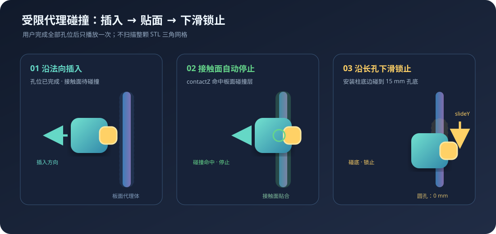
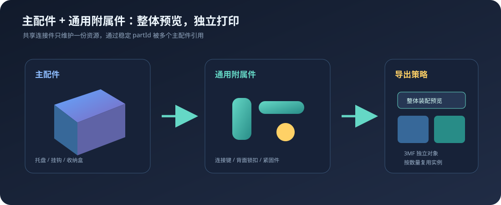

# SnapBoard 更新记录

## 2026-09-25 · 3MF 盘命名改为板号（P01、P02），配件盘只叫「配件」

- 整块 3MF 在切片软件里的盘名原来按盘序编「SnapBoard 板件 第 N 盘」。一盘装不下整单板件时盘序与 P 编号必然错位（盘 1 可能装 P01 和 P02 各一部分，盘 2 才是 P03），刻着 P01 的板子到底在哪一盘完全对不上。
- 改为：板件盘直接用盘内板件的 P 编号命名（`SnapBoard 板件 P01`，一盘多板时 `SnapBoard 板件 P01、P02`）；配件盘只叫 `SnapBoard 配件`（多盘时才补序号）；试样盘保持「试样（先打印）」并同样去掉盘序。
- `verify:native-process` 新增盘名回归：板件盘名必须匹配 `SnapBoard 板件 P\d+`、配件盘必须以「SnapBoard 配件」开头、任何盘名不得再出现「第 N 盘」；逐板导出每块板的盘名必须等于自己的板号。`tsc -b`、lint、`verify:assembly-marking` 全部通过。**需重启 dev server 后重新导出才生效。**
- 顺带修复：`verify-native-process.mjs` 的 vite 缓存目录移到系统临时目录，默认 `node_modules/.vite` 在沙箱环境里二次优化时整删失败会直接打挂进程。

## 2026-09-25 · 配方网格杂色碎斑清理（打印"点点点"起球）

- 用户实测打印失败 3 次：色块里大量 1–2 格的孤立杂色点，切片后每个都变成一次微型挤出加一次换料，喷嘴不停"点点点"，堆料起球。这正是实施日志 §8/§13.2 早已确诊但未实现的"配方网格边缘清理"。
- 实现 `despeckleRecipeGrid`：4-连通同配方区域中，格子数不超过阈值（小于两个线宽，按当前间距折算成格数，×8 时约 22 格）的孤立碎斑整体改判为邻域多数票主配方；细长线条连通域大、不受影响。
- 真实「长亮」×8 + 逐板实测：**归并 73.9 万处碎斑 / 145.7 万格（约占整网 9%）**，整包体积 448 → **225 MB（-50%）**，导出耗时 381 → **143 s（-62%）**；切片后的微型挤出与换色次数同步大幅下降。
- 新增 `verify:native-despeckle` 门禁（单格/多格碎斑归并、细线保留、边界碎斑、对照通道、4M 格性能）；`verify:native-process` 全绿。**需重启 dev server 后重新导出再切片。**

## 2026-09-24 · 逐板导出背面标识修复（板号 + J 接缝贴边指示）

- 用户报告逐板导出的每块板**边缘接缝指示消失**。排查发现比这更严重：逐板调用只把单板喂给 `buildAssemblyMarkPlan`，邻接图为空 → J 接缝贴边数字/箭头全部丢失；且 `stablePanelIds([单板])` 恒为 P01 → **每块板的背面刻字都被刻成 P01**（截图里的 P01 只是恰好同名）。
- 修复：`Manufacturing3MFInput` 新增 `markingPanels`（仅用于计算背面标识的整单板件集合，与 textureBounds 同一思路）；本地制造进程逐板调用传入 `payload.panels`；标识按 `sourcePanelId` 匹配，内存与流式两条导出路径同步统一。每个板件文件同时内嵌完整装配图（`snapboard-assembly-map.json`），拿去单块打印也能看到全部接缝关系。
- `verify:native-process` 新增四板逐板回归：每块板文件必须带整单接缝信息、J 接缝标识（`kind: 'seam'`）、背面标识实际写入，且四块板刻字板号互不重复。`verify:assembly-marking`、`tsc -b`、lint 全部通过。**此前导出的分板压缩包标识有误，需重新导出。**

## 2026-09-24 · 高精度导出中途 Failed to fetch（制造进程内存）修复

- 根因：极限精度（×8）逐板导出时，本地制造进程把 11 块板的 3MF 全部攒在堆里、再整体 zipSync 并复制一份，实测干净进程峰值堆 2.4 GB / RSS 3.3 GB；长期运行且连着浏览器的 dev server 基线更高，再叠加已完成作业结果在堆里留存 30 分钟，堆被顶穿后**进程整个死掉**，浏览器轮询只能看到 Failed to fetch（现场定格在最后一块板的压缩/拼包阶段，即内存最高点）。
- 修复：制造产物一律落盘（作业临时目录）——逐板 3MF 写完即释放，分板压缩包改用流式存储 ZIP 逐条拼包，回传从磁盘流式发送（含单文件模式）；失败/取消立即清理临时目录，成功产物由 30 分钟过期清扫一并删除。尾部峰值与结果留存合计约 1.3 GB 的堆占用被消除。
- `start-dev.bat` 增加 `NODE_OPTIONS=--max-old-space-size=8192` 作为过渡期保险；单板生成期约 2.3 GB 的瞬态峰值仍有，根治要靠诊断文档规划的 Node 侧流式导出器（后续工程）。
- 用真实「长亮」工程 ×8 + 逐板在隔离 dev server 复现并复测：修复前峰值 2389 MB / 3300 MB，修复后拼包阶段不再累积，381 s 完成、448 MB 整包；`verify:native-process` 全部通过（含产物重复取回断言）。**需重启 dev server 生效。**

## 2026-09-24 · 分板 ZIP 保存后缀修复

- 修复逐板导出的分板压缩包被项目库保存接口强行补 `.3mf` 后缀（`长亮-分板.zip` → `长亮-分板.zip.3mf`）导致切片软件打不开的问题：保存接口的白名单加入 `.zip`；「另存为」对话框按实际内容在 3MF 与 ZIP 类型间切换，不再给 ZIP 补 3MF 后缀。
- 内容本身一直是合法 ZIP（11 块板 + 配件共 12 个 3MF 条目），改名回 `.zip` 即可正常使用。
- 修复逐板导出把整单配件重复打进每块板的问题：逐板循环展开 payload 时带上了全部 `placedParts`，每个 `-Pxx.3mf` 都多含一整套配件（打印即重复）。现在板件文件只装对应板件，配件仍统一由 `-配件.3mf` 交付；`verify:native-process` 新增逐板回归（板件文件不得含配件、配件文件必须含配件）。**此前导出的分板压缩包需要重新导出。**

## 2026-09-24 · 本地制造缺件与作业并发修复

- 修复本地资产读取器未还原 URL 百分号编码导致的中文路径 404：`URL.pathname` 先解码一次再解析磁盘路径，先校验（拒绝坏编码、`..`、反斜杠与越出 `public` 根目录的路径）再读文件，错误信息附上资产地址。配件库 88 个中文名模型在本地制造进程全部可读，带配件工程导出不再缺件。
- 本地制造作业 API 同时只允许一个作业：资产 shim 替换的是进程级 `globalThis.fetch` 并在结束时恢复旧函数，并行作业会互相拆除对方的 shim（间歇性资产 404 / shim 残留）。第二个提交改为返回 409 与明确提示，能力接口新增 `busy` 与当前阶段。
- `verify:native-process` 转回绿色门禁并扩充：运行中提交被拒与 busy 状态、ASCII / 百分号编码中文 / 越界 / 坏编码路径直测、配件实例实际进入 3MF（核对 `uniqueObjectCount` 而非只看 warning 为空）。
- 依据与验收顺序见 [本地制造缺件与作业并发故障诊断](SNAPCOLOR_NATIVE_MANUFACTURE_BUG_DIAGNOSIS_20260924.md)。

## 2026-09-23 · 农场校色第一期

- 复用 Lumina 校准核心，并以 SnapColor 校色管理界面完成四色和五色双页的生成、拍摄取色、修正和合并。
- 新增带哈希校验的 `.snapcolor` 包、自定义档案注册、工程 ID 绑定和缺失档案明确报错；状态区分 `extracted` 与真实样卡后的 `verified`。
- 本地 Python 任务隔离和桌面离线 payload 已实测；真实农场样卡和正式安装程序待完成。范围与证据见 [农场校色实施记录](SNAPCOLOR_FARM_CALIBRATION_PLAN_20260923.md)。
- 已另行生成不覆盖旧版的 Windows x64 NSIS 测试包；解包 Python 校色核心可用，完整 Electron GUI 的本机启动测试受 GPU 缺失 DLL 阻断，尚未作为安装验收。
- 修复开发网页校色页误用系统 Python 导致的 `No module named 'cv2'`：自动使用已构建的桌面校色运行时，网页实测恢复校准板生成。

## 2026-09-23 · 大型纹理 3MF 导出修复

- 制造网格 XML 改为分块编码并写入 ZIP 流，避免顶点/三角面一次性拼接为超长字符串时出现 `Invalid string length`。
- 进一步将光栅连续轮廓逐层移入可取消的 Web Worker，大型网格 ZIP 改为异步压缩；导出进度现在覆盖逐层轮廓处理，界面不再在这两段长时间失去响应。
- “重置工程纹理”加入紧凑进度条，跟随配置提交和下一帧预览刷新；完成提示短暂保留。
- 多热床、背面装配标识和纹理 3MF 回归通过；用户截图对应的原工程尚待重新导出确认。
- [多图片排版与导出实测记录](MULTI_IMAGE_MAPPING_SOLVE_SEPARATION_PLAN_20260923.md#9-2026-09-23-实施与验证记录) 包含 12 图层和 35 长孔的浏览器内存导出、取消及进度测试；尚未以用户原工程实测。
- “长亮”实测发现旧路径为 11 板同时堆积网格；改成逐板逐物理层写入同一个 3MF、及时释放内存，模型分成多个标准 3MF 条目以规避单条目 4 GB 上限。真实工程生成约 784 MB 单文件、11 热床、20 配件，峰值堆约 1.32 GB；逐条目完整性与 ZIP CRC 通过，切片器/实物仍待确认。详见上述实测记录。

## 2026-09-23 · 记住上次抽样与正反面核对图

- 成功保存试样 3MF 后，将抽样坐标、边长和来源板指纹写入项目；重新打开抽样窗口时恢复匹配的坐标，板件变化则提示重新确认。
- 同时输出一张正面纹理抽样、背面装配标识的 PNG，与 3MF 一起存入“制造导出”。
- 完整流程与回归结果见 [抽样实施说明](TEXTURE_SAMPLING_IMPLEMENTATION.md)。

## 2026-09-23 · 纹理抽样背面凸刻编号

- 每片试样背面加 0.24 mm 凸刻编号，与 S01/S02 等试样身份对应；狭窄区域可用 01/02 简写，放不下完整数字时提示重新选点。
- 试样彩色面朝热床，必要时补 0.24 mm 薄承托层；完整原板和颜色配方不变。
- 实际 3MF 浏览器回归通过，覆盖标准样片、贴面、孔位和长孔相切位置。见 [抽样实施说明](TEXTURE_SAMPLING_IMPLEMENTATION.md)。

## 2026-09-21 · CAD DXF 草图导入第一期（源码）

- 文件区新增 DXF 导入弹窗，保留几何尺寸与位置；支持线、圆、弧及二维多段线，预览单位/图层并批量指定轮廓用途。
- 导入几何默认锁定，可在侧栏改为外轮廓、内孔或辅助线；追加导入支持一次撤销/重做。
- 开放/无效轮廓不擅自补齐，不支持实体列出确认提示；新增 `verify:cad` 与测试夹具。
- Edge 实测 100×50 mm 板含圆孔的导入、撤销/重做、自动分割；详情见 [CAD 导入记录](CAD_IMPORT_PHASE1_20260921.md)。本项未重打桌面安装包。

## 2026-09-21 · 1.2.0-beta.1 伙伴测试封装

- 汇总1.1后的连续轮廓制造、纹理抽样、抑制色斑和工作区修复；49项核心回归及浏览器/桌面制造流程复测。
- 修复抑斑文案漏译，补齐配件装配动画依赖；测试安装包内置7个资源包共88个配件和19个宿主。
- 修复“我的配件”重复ID导入冲突，升级按包ID补齐缺失资源且保留用户数据。
- [完整更新、排障与测试范围](TEST_RELEASE_20260921.md)。产物为Windows x64测试版，未自动公开发布。

## 2026-09-19 · 浅色图案色斑修复

- 使用“拼装演示”原工程复现近似肤色被匹配成差异明显叠色的问题，在配方匹配前加入有色差边界的浅色稳定化。
- 原清理开关更名为“抑制色斑（保留原图边缘）”，默认开启；像素艺术与直接SVG保持原规则。
- [原因、实际对比与限制](FACE_COLOR_CONTINUITY_20260919.md)。仅更新开发文件，实物效果待验证。

## 2026-09-12 · 英文工作区漏译修复

- 补齐板型库、纹理抽样、纹理制造、装配标识、高级分割和文件操作文案；增加取消分割数量及抽样状态动态翻译。
- 多行说明匹配统一空白，上传预览标题保留文件名，英文抽样弹窗底栏允许换行。
- 新增8个组件的固定文案扫描回归，并实测英文板型库、分割状态更新和切回中文。范围与维护说明见[I18N_AUDIT_20260912.md](I18N_AUDIT_20260912.md)。

## 2026-09-12 · V1.1 基线封存 / 1.2.0-dev.1 连续轮廓

- 先生成 V1.1 Windows 安装包和对应源码快照，再开始轮廓改革；旧安装包保留。
- 新增叠色共享边界制造和纯色 SVG 直接轮廓两条路线，预览与 SVG 配方同步，保留同包抽样及基材参数。
- 新增可关闭的连续轮廓开关、逐层制造诊断与自接触保护回退。
- [实现、实测范围及限制](TEXTURE_CONTOUR_IMPLEMENTATION_20260912.md)；[开源方案与来源核对](TEXTURE_CONTOUR_RESEARCH_20260912.md)。开发版未打新安装包，实际打印提速待试样验证。

## 2026-09-05 · beta.2 独立配件包与尺寸输入修复

- 软件与配件资源分别交付；新增“设置 → 配件库 → 导入资源包（.sbpack）”和空库引导，支持多选、导入后立即刷新、重启保留，无需命令行。
- 桌面与开发服务共用资源包校验及导入逻辑：限制体积、路径、文件类型，拒绝重复覆盖；同步失败回滚本次新包，不删除既有配件。
- 智能尺寸输入不再直接显示完整浮点数：常规值最多三位小数，未改值确认保留原始精度。矩形/内孔/正多边形求解逻辑不变。
- 7 个独立包、88 个配件已在干净数据目录全部导入，分类与标定一致。资源仍保留 Private 等原始授权声明，仅作本地交付验收，未自动公开上传。
- 验证及使用方式见 [独立配件包与尺寸输入验收记录](RESOURCE_PACK_AND_DIMENSION_FIX.md)。

## 2026-09-05 · 整体检查与独立 Windows 桌面安装包

- 完成40项核心回归；修复背面凹刻框与通孔重叠导致标记网格破面的问题，保留闭合校验。
- 修复首次导入自定义细分目录时父目录不存在的问题；命名输入改用软件内对话框，兼容 Electron 的 prompt 限制。
- 修复分割尺寸显示浮点长尾，显示最多两位小数，几何数据保持原精度。
- 新增独立 `desktop/` 构建：打包生产页面、本地 API、Chromium 与 Node，用户无需开发环境。
- 安装产物位于 `release/desktop/`；用户工程/配件进入 `%APPDATA%/SnapBoard/workspace/`，默认不携带开发者个人工程和 Private 配件库。
- 详情：[整体检查与桌面封装记录](DESKTOP_PACKAGING_DEBUG.md)。

## 2026-09-05 · 智能尺寸与曲线稳定性

- 保留求解器双精度，取消0.1绘图单位取整与求解后近似正交吸附；小斜率边不再误加H/V，开放链不再使用鼠标吸附半径判断闭合。
- 修复小圆被四边形最短边检查拒绝、自动R与新D互相锁死、混合弧R引线未引用edgeIndex的问题。
- 圆/圆弧几何与尺寸统一为复合命令，R/D参考值同步；输入框保留原值，圆/弧异步求解拒绝过期项目结果。
- 新增小数圆心、小半径、270°弧、固定斜线、R/D协调及撤销/重做回归；能力盘点、验证和待扩展项见[智能尺寸排查记录](SMART_DIMENSION_DEBUG.md)。

## 2026-09-05 · SnapColor产品化封装与图片入口收敛

- 主程序多色光学层统一更名为SnapColor：类型、函数、默认LUT ID、运行时资源目录、Bambu模板副本、界面、进度提示和3MF对象名全部切换；新工程只写`snapcolor`与`snapcolor-petg-*`。
- `luminaLut.ts`迁移为`snapColorLut.ts`，`public/lumina`迁移为`public/snapcolor`，9个生产LUT/stack资产统一改为`snapcolor-*`；未使用的旧Bambu副本移入vendor归档，运行时不再直接导入vendor模板。
- 旧`surfaceMode=lumina`、Aliz/魔创/Bambu LUT ID仍作为只读迁移别名，打开后转换为SnapColor；法律声明和vendor原始归档保留真实第三方来源，不因品牌包装删除。
- 新增统一功能门，暂时关闭像素艺术与SVG矢量纹理入口；文件选择和拖放只接受PNG/JPG/WebP，旧pixel/vector工程读取后转为高保真图片。多图片、阵列、每板分配、调色、封边和3MF制造继续保留。
- 新增[`SNAPCOLOR_PACKAGING.md`](SNAPCOLOR_PACKAGING.md)，记录改前/改后矩阵、运行链路、兼容表、文件职责、法律边界，以及未来重新开放像素/SVG必须完成的检查表。
- 新增`verify:snapcolor`并纳入`verify:texture`；覆盖9个运行时资产、品牌命名、入口关闭、MIME限制、3MF名称和旧工程迁移。

## 2026-09-04 · 图片/SVG来源感知的圆角生成

- 从圆角索引的上游修复图片轮廓斜边出现三角缺口和错误 R8：草图已有的 `source.kind` 现在会转换成 `preserve-source` 策略并随分割任务传入 Worker，不再在进入分割器时丢失来源语义。
- 图片、SVG和预制板型只保留用户已经确认的原始外轮廓，不再对斜边离散出的细小正交台阶二次生成板角；普通手绘/CAD轮廓继续使用原来的自动圆角算法。
- 该策略只决定 `roundIdx` 是否生成，不修改分割轮廓、板件坐标、接缝和孔位，因此不会再次造成规则板下边缘错位。
- 打开旧工程时会根据源草图元数据清除图片轮廓中已经保存的错误派生圆角索引，轮廓点和孔位保持原值；新增来源传播、旧工程迁移和普通CAD不受影响的回归测试。

## 2026-09-04 · 3D背面接缝安装辅助

- 修复导入图片并分板后，所有板件背面共用深色基材导致接缝完全不可见的问题；背面视图现在仅按真实共享边绘制一条黄色高亮，不改动分割轮廓与圆角算法。
- 接缝线直接复用装配标识系统的 `axis / coordinate / start / end`，与两侧同号箭头和3MF装配关系一致；它是纯预览辅助，不会写入实体、纹理或制造文件。
- 接缝辅助只在“背面”安装视图显示，正面与自由视角默认隐藏，避免遮挡彩色图片；底部操作提示同步说明沿接缝两侧同号箭头安装紧固件，并补齐英文UI。
- `verify:assembly-marking` 新增接缝坐标同源、单条黄色高亮、背面Z位置和 `previewOnly` 回归。

## 2026-09-04 · 分割板背面永久装配标识

- 根据实物可读性反馈把贴边箭头改为大号优先：4.2mm 数字/4.0mm 箭头；孔阵放不下时依次降为 3.6/3.6mm 和 3.0/2.2mm，并在整条接缝主动搜索两侧共同空档。标准 200mm 接缝选择中号 3.6mm 数字+3.6mm 箭头，相比旧 2.2mm 箭头增大约64%。
- 3MF 汇总新增背面标识请求数和实际成功数，顶部状态明确显示 `4/4`；有警告时同时提示切片器需要翻到语义背面或查看首/末表层。对象名只在制造几何真正成功时追加“背面凹刻”，安全回退不再误标。
- 用真实四板“展示”纹理工程验证当前短号制造链：24.24MB 3MF 含4结构基材、4承托层、4基材封边、16光学部件，四块基材均有背面凹刻且 assembly-map 存在。切片器耗材视图不显示异色纹路是因为标识与基材同材质；是否缺失以成功计数、对象名和首末层为准。
- 修复在分割工作区取消/重新自动分割时整页白屏：`AssemblyMarkingPanel` 的 Zustand selector 在 `splitResult=null` 时返回了每次新建的 `[]`，React 19 因快照不稳定进入无限更新并抛出 `Maximum update depth exceeded`；现改为 selector 只返回稳定的 store 字段，组件外复用固定空数组。浏览器已实测“脑洞大开 → 取消分割 → 再自动分割”，结果正常恢复且无控制台错误。
- 新增全局稳定 P 板号、真实共享边配对、套件码、SNAPBOARD 品牌和 UP 朝向；实体接缝采用两侧同位置、面对面的短数字箭头，完整 J/P 关系只留在界面和装配表，避免 `J02-P01` 长串难辨认；自动避让长圆孔、φ5 圆孔、候选孔、内孔、缺口和窄边。
- 右栏“分割”加入可折叠的背面标识面板，支持独立开关、参数调整、接缝关系预览和一键切换 3D 背面；修复面板被 sticky 结果区压缩覆盖、看得见但点不到的问题。
- 背面预览与制造共用同一多边形规划，字形按背视图镜像；3MF 使用“浅凹底框 + 同材质齐平字形 + 完整上部基材”形成不贯穿、不凸出的真实几何。
- 标识进入对象签名，避免相同尺寸板件复用后得到重复编号；3MF 新增 `Metadata/snapboard-assembly-map.json`，供装配图和打印农场拣件流程复用。
- 新增 `verify:assembly-marking`，覆盖双板、L/U/缺口形、双侧接缝码、唯一编号、闭合制造网格和 3MF 元数据；实物 PETG 字深/字高仍需打印标定。

## 2026-09-04 · 擦除菜单完整展开与滚轮隔离

- 修复顶部工具栏启用横向滚动后，擦除二级菜单被`.tb-groups overflow-x:auto`裁切、只能显示一部分的问题。
- 擦除菜单改用Portal挂载到页面顶层，按触发按钮视口坐标固定定位；右侧空间不足时自动翻到左侧，上下位置始终限制在可见窗口内。
- 菜单独立承接滚轮并使用`overscroll-behavior: contain`，鼠标位于菜单时不再推动整条顶部工具栏；窗口缩放和任何祖先滚动时都会重新计算位置。
- 1180×650窄屏实测：菜单260×173px完整可见；菜单滚轮前后工具栏`scrollLeft`保持0；工具栏主动横移56px后菜单同步移动56px。新增`verify:ui-layout`结构回归。

## 2026-09-02 · 大型 SVG 多图片预览不再退回灰色底板

- 进一步确认参考实现可正常显示而本项目偶发灰板的差异在实时渲染架构，不在 SVG 文件或旧版颜色算法：当前 SVG 的 data URL 约14MB，拖动尺寸时旧实现会反复解码并为每个 pointermove 重跑K-Means/LUT。
- 新增按资源 revision 的图像解码缓存，最近8个资源复用同一个 `HTMLImageElement`；重复导入/多图层引用同一 SVG 不再重复解码几十MB位图。
- 合成阶段先解析可见图层的真实 placements，只加载被引用的资源；隐藏或未使用的多图片资产不参与本次预览生成。
- 3D纹理重建增加140ms防抖，连续拖动/缩放只提交最后一次生成；避免旧任务堆积导致最新纹理迟迟无法显示。
- 资源解码失败不再静默跳过，也不再用`texture=null`把上一帧替换成灰色底板；现在保留最后一次成功纹理并输出具体失败资源。
- 真实“展示”工程（约14MB Illustrator SVG、4块板）初次加载和连续编辑后均保持纹理，控制台无纹理警告；旧版`23efe37`色彩层次保持不变。

## 2026-09-02 · 色彩层次选择性回退到 Git `23efe37`

- 按用户要求检查全部 Git 历史：`3ba160c` 是最初发布版，`23efe37`（2026-08-30 22:51，`checkpoint before independent color migration`）是独立颜色迁移前的最后稳定中间版，本次以 `23efe37` 为回退基准。
- 只回退色彩层次相关实现：恢复亮度/对比度/饱和度 `1/1/1`、48设计色、色相保护`0.35`、孤立配方点清理开启，以及旧版 `brightness→contrast→saturate→K-Means→LUT` 处理顺序。
- 调色区恢复旧版原色/黑白/色阶、四个基础滑杆、LUT、颜色细节、色相保护和清理开关；移除后来加入的照片增强/强对比预设、SVG自动改参数、颜色安全域限制和额外打印指标卡。
- 明确保留当前多图片资源/图层、自由/阵列/每板分配、数学密铺、正视拖动、纹理避让、基材封边、全局连续UV和3MF分层制造；没有整文件回退，也没有使用`git reset`。
- 用户 Illustrator SVG 本身未被修改；保存工程中的图片位置、分板和多图数据继续沿用当前格式。

## 2026-09-01 · 板型库后矩形参考线对齐一致性

- 修复板型库创建轮廓后绘制矩形时，预览已经显示边缘对齐、第二次点击却留下数像素偏差的问题。根因是预览使用参考线单轴锁定，矩形提交只读取端点/中点吸附，导致屏幕反馈与保存坐标不一致。
- 两点矩形、中心矩形和三点矩形现在共用“直接吸附优先，否则采用参考线坐标”的提交规则；板型库含小数坐标的端点也直接复用原值，不做破坏曲线精度的整数取整。
- 浏览器实测先由板型库创建圆角胶囊，再绘制两个上下相接矩形；第二个矩形以原始鼠标 `6 px` 偏差靠近右边缘，提交后自动锁定到同一 X 坐标，高倍缩放仍无台阶或缝隙。
- `verify:ui-layout` 增加矩形预览/提交同源检查，防止后续只修改悬停预览而漏掉最终落点。

## 2026-09-01 · 智能尺寸共线整边与补线拓扑修复

- 修复 D 形、圆角板等混合圆弧轮廓中“一条直边被冗余中点拆成两段”后只能标注短段的问题：相邻、同向、共线且非圆弧的边现在作为一条逻辑直线处理，悬停会高亮整条链。
- 智能尺寸既支持依次点击任意两个共线子段，也支持直接点击整边两个端点；尺寸预览、标签和持久化约束统一使用逻辑直线两端，实测两段 `50 + 50 mm` 显示为整体 `100 mm`。
- 修改逻辑直线总长时按原比例分配各子段，并保留中间拓扑点共线；混合圆弧端保持相切稳定。浏览器回归把整体高度从 `100 mm` 改为 `120 mm`，D 形圆弧与上下直边同步保持连续。
- 修复擦除两段短边后补画一条长边时“自动分割正确、2D 轮廓显示仍断开”的问题：实体直线完成后会把开放混合曲线与补线合并为同一个含 `ArcEntity` 的闭合轮廓，选中、高亮、尺寸与制造拓扑一致。
- 新增 `npm run verify:collinear-dimension`，覆盖共线链识别、端点识别、圆弧排除、正反方向补线和圆弧索引保持；并通过 build、智能尺寸、复杂曲线约束与平面面域回归。

## 2026-09-01 · 心形尖角制造网格与3MF自适应倒角

- 修复心形、星形等尖角异形板导出被“网格未完全封闭”拦截：根因是统一0.35mm制造倒角在局部尖点自交，产生6—8条开放边；分割轮廓和纹理本身有效。
- 每块板独立尝试配置倒角、1/2、1/4和0，采用第一个通过闭合边检查的结果；普通板仍保留0.35mm，心形测试板自动降至0.09mm。安全校验继续保留，不允许把破面3MF写出。
- 自适应倒角接入普通结构板、SnapColor结构基材和单材质贴面。成功降级会作为3MF提示显示，明确指出板件、原倒角和实际倒角。
- 新增 `verify:heart-3mf` 并纳入 `verify:3mf`。真实420mm心形SnapColor导出验证：4个结构基材、4个承托层、4个基材封边、12个光学对象，复合3MF校验通过。

## 2026-09-01 · 每板图片手动分配与资源保留

- 修复每板模式只能按顺序循环：序列层新增`panelId → assetId`显式映射，P1/P2/P3分别提供图片下拉框，可自由选择任意已导入资源；未手动指定的板仍按自动序列分配。
- 图片资源托盘与排列图层彻底分离。删除普通图层不再清理资源；退出每板模式或关闭唯一序列层时，所有已导入图片自动恢复为自由图层。
- 新增“恢复自动顺序”和“退出每板模式并恢复自由图层”明确操作，避免把序列层的×误解成删除原图。
- 浏览器实测两张SVG、三块板：P1可独立从favicon切换为icons；退出与点击序列×后均保持2个资源并恢复2个自由图层；中英文与控制台无错误。

## 2026-08-31 · 纹理工作室：数学密铺、多图片与正视辅助

- 新增方格、正三角、正六边形和Truchet圆弧砖四类毫米级程序化密铺；图案锚定全局世界坐标，确定性种子保证预览、分板与3MF一致，六边形实测跨P1/P2/P3接缝连续。
- 新增多图片资源/图层模型：一次最多导入12张，工程最多32资源/64图层；每图可自由、矩形阵列、错列阵列或每板重复，并有X/Y、宽高、旋转、间距和透明度控制。
- 新增“每板一张”序列层，按板件顺序分配多图，图片不足时循环；每板图像按真实板件轮廓裁剪，最终仍合成为全局Canvas。
- 选中自由/阵列图层可在正视3D中拖动虚线框与滚轮缩放；实测图层从`(238,120)`拖到`(343,159)`，尺寸由`160×80`缩放到`219×109mm`，未影响其他图层。
- 打开纹理工作室会保存完整相机/OrbitControls状态并自动正视，旋转锁定但保留平移缩放；关闭后精确恢复进入前自由/正面/背面视角，pointer取消也会恢复控制器。
- `BoardTextureConfig.source`扩展为`preset/image/composition/pattern`；旧单图继续兼容，新增组合和密铺配置随工程保存。3D与3MF继续共用同一合成Canvas、SnapColor LUT、孔洞掩膜、倒角与基材封边。
- `npm run verify:texture`新增密铺、编排、视角与总接线回归；中英文词典同步覆盖新工作区。详细设计见[`TEXTURE_COMPOSITION_AND_TILING.md`](TEXTURE_COMPOSITION_AND_TILING.md)。

## 2026-08-31 · 预制板型库与自定义轮廓导入

- 顶部工具栏新增“板型库”，内置原创云朵、拱门、爱心、星形、月牙、波浪、小屋和圆角胶囊 8 种板型；支持宽高、等比、翻转、圆润度和细节预览。
- 支持将板型作为新外轮廓替换当前设计，或缩放后作为内孔插入；替换复用“重画”事务，旧分割、配件、纹理和分析状态同步清理，一次撤销完整恢复。
- SVG 导入支持 path/polygon/polyline/rect/circle/ellipse 及直线、二次/三次贝塞尔和椭圆弧离散；拒绝 script、use、外链、事件属性和 foreignObject。
- PNG/JPG/透明图片在浏览器本地按透明度或亮度提取最大连通剪影，提供阈值、反相、平滑和简化；不上传原图，不把照片内容混入项目运行时。
- 统一检查闭合、自交、孔包含、碎片、窄结构和顶点上限；预览、错误和制造警告在应用前显示。新增 `verify:shape-library` 聚合回归。
- 板型库入口从工具栏末尾移到编辑工具之后，固定使用珊瑚橙独立色，不再随“更多工具”隐藏；应用后自动缩放视图以显示完整轮廓。
- 修复板型尺寸把毫米误当世界单位：写入草图前按 `pixelToMM` 转换，420×210 mm 在 0.5 mm/单位工程中仍标注为 420×210 mm，不再缩成 210×105 mm。
- 位图导入不再丢弃分离文字/图标：显著连通组件保留为多个 outer，内孔按全局包含层级归类；自动分割可一次生成多块独立招牌板。白色背景在阈值255时保持排除。
- 板型参数新增旋转角度：支持 −90°、归零、+90°快捷操作、−180°到180°滑杆和任意角度输入；预览实时显示旋转后的占用宽高，应用结果与预览方向一致并记录 rotation 来源参数。
- 选择工具新增对象包围框：点击边选择单轮廓，空白处按住拖动框选多个完整轮廓；选择组显示四个等比缩放角点和顶部旋转手柄，框内拖动整体移动。每次组变换作为一条 CompositeCommand 撤销，缩放/旋转后自动适配视图。
- 包围框变换当前保护CAD约束：导入/预制及无约束轮廓可直接操作；含驱动尺寸、构造线或无限线的选择组会提示先解除约束，不会悄悄破坏几何关系。
- 修复手绘粗线被当成空心窄环：上传区新增“智能 / 实心剪影 / 闭合线稿”，闭合线稿识别近似平行的内外描边并填充内部。A4实测由2118点降至205点、1个outer/0个inner，分割2块且覆盖率100%，3D为实心板。
- 位图平滑由会收缩且增点的Chaikin改为Taubin λ/μ非收缩平滑并校正面积；RDP容差按图片分辨率自适应，阈值增加可直接输入的数字框，闭合线稿模式提高杂点组件过滤阈值。

## 2026-08-31 · 实物打印反馈：彩色光学层基材封边

- 根据首个彩色圆板实物打印结果，确认毛边集中在外轮廓和长孔/圆孔边缘：多色光学单元直接抵达边界会形成大量短外墙、频繁换色端点和悬空料头。
- SnapColor 制造层默认增加 `0.50 mm` 基材单线封边墙，使用1号结构基材耗材，贯穿全部光学层；外轮廓、长圆孔、圆孔和其他内孔统一按距离场识别。
- 封边区域会从各彩色材料网格中剔除，不与彩色体积重叠；每个0.08mm光学层继续按制造倒角收缩，因此封边不会破坏原有外缘/孔口倒角。
- `BoardTextureConfig` 新增 `edgeSealEnabled / edgeSealWidth`；旧工程默认启用0.50mm，纹理工作室可开关并在0.30–1.20mm间微调，中英文界面同步支持。
- 新增 `textureEdgeSeal.ts` 纯几何判定和 `verify-texture-edge-seal.mjs`，覆盖外边、孔边、内部保留、关闭路径、1号基材挤出机和光学层高度；`npm run verify:texture` 已包含该回归。

## 2026-08-31 · 中英文双语界面与热切换

- 新增 `zh-CN / en-US` 运行时语言层，顶部常驻“中 / EN”热切换按钮；切换不刷新页面，语言选择保存到 `localStorage`，再次打开仍保持上次选择。
- 内置设计器、绘图工具、文件操作、分割/配件/纹理/分析四个工作区、配件预览、装配标定器和设置中心覆盖中英文；Portal 弹窗也纳入同一语言表面。
- 当前词典覆盖 562 条软件内置文案和动态数量句式；补齐左侧特征树、选中轮廓属性、数学密铺、多图片图层和约束提示。图标与文字写在同一节点时保留图标，只翻译固定文案；宿主名称、状态与可访问性标签同步切换。
- 用户导入的零件名、项目名、资源包名、自定义目录和说明保持原文，不做自动翻译；对应节点使用 `data-i18n-ignore` 或因不在内置词典中自然保留。
- 英文模式改为可读性优先布局：工具文字 12.5px、左栏标题 13px、正文 12.5px、项目名 14px，同时增加按钮高度、卡片内边距和合理换行；工具栏在空间不足时横向滚动，不再通过压缩到 9–10px 塞入。新增 `npm run verify:i18n` 回归检查。
- 修复装配步骤数字受旧 `.mount-scene-heading > span` 高优先级 flex 规则影响而靠左：步骤方框现在使用更高优先级的 grid 居中规则，数字在 27×27 px 方框内水平、垂直居中。

## 2026-08-31 · 配件库重构为任务式“配件插入器”

- 按真实装配顺序重排右栏：先选择“安装到”哪种宿主，再进入“选择配件”；场景切换会直接驱动适配数量、默认显示范围和卡片状态。
- 删除会覆盖首批卡片的九项分类悬浮菜单，分类、细分、遮挡与排序改为同栏内联筛选页；筛选页出现时结果列表退出，不再产生多层浮窗和 z-index 竞争。
- 主列表新增“适配当前 / 全部”范围切换，非洞洞板场景不再沿用旧洞洞板锚点标签；卡片明确显示“可直接装配 / 需要完成装配标定 / 缺少导轨卡扣或型材连接器”。
- 卡片从厚重多徽标卡改为单层列表行，只保留缩略图、名称、尺寸、当前兼容状态和拖入3D提示；资源序号、格式、作者与遮挡技术细节移出主视图。
- 原来的铅笔/齿轮合并进单卡“⚙ 配件设置”；选中配件后底部出现“查看预览 / 去标定 / 按住卡片拖入3D”的任务操作栏。
- 大面积常驻导入框改为标题栏“导入”按钮和整片列表文件拖入；资源包摘要、批量、顺序调整和细分增删进入“管理配件库”，资源版本与文件统计继续由设置中心承载。
- 配件库标题栏将含糊的三点菜单改为明确的“⚙ 管理”；每张配件卡改用“⚙ 配件设置”，弹层显示配件名及“查看详情 / 编辑资料与图片 / 装配标定”三项完整操作，并修复后续卡片覆盖弹层导致文字发暗、按钮无法点击的问题。
- 配件大图预览加入由真实标定数据驱动的装配演示：在同一画布播放“对准孔位 → 插入贴面 → 下滑/零偏移锁止”，支持连续重播和返回模型；尚未标定的配件会直接提示并可进入装配标定器。
- 修复预览装配与标定器位姿不一致：删除仅按 `contactZ` 平移模型的简化动画，改为复用参考板真实孔位目标、`fitPartAnchors` 刚体配准结果、`rotationZ` 和锁止距离，因此预览与标定器会命中同一类孔组并保持相同朝向。同步放大配件库状态文字，把尺寸、可装配、拖入3D与低遮挡拆成可换行标签；数字统一使用等宽字形。
- 新增 [`PART_LIBRARY_UX_RESEARCH.md`](PART_LIBRARY_UX_RESEARCH.md)，记录 Autodesk、Onshape、SOLIDWORKS、Carbon 与 Fluent 的一手交互依据和回归底线。

## 2026-08-31 · 装配资源包与设置中心

- 将装配宿主从源码常量扩展为独立 `装配资源包/`：源包、JSON Schema、同步脚本和 `public/assemblyLibrary/index.json` 分层存放；`predev/prebuild` 自动同步，前端运行时索引与内置目录合并。
- 宿主库扩展为 4 个包、19 个规格：SnapBoard 洞洞板；TH35-7.5、TH35-15、G32、15 mm 微型导轨；item Line 5/6/8/10、Bosch Slot 6/8/10、MISUMI HFS5/6/8；胶粘、Dual Lock、石膏板微型插针和螺钉锚固墙面工艺。
- 所有厂商/系列使用独立 `systemKey` 与 `compatibilityKey`。Bosch 公开资料不足以确认的内腔尺寸保存为未知并关闭自动截面匹配，不再从“槽 8”名称猜测兼容性。
- 新增 `npm run assembly:sync` 与 `npm run verify:assembly-library`，检查包引用、宿主 ID、兼容键、连接器类型、装配 recipe 和占用规则；当前 19 个宿主无重复键、无同步警告。
- 顶部增加“设置”入口，设置与资源中心提供概览、配件库、装配宿主、项目文件和受控目录五页，可查看 88 个配件、资源包版本、标定数量、宿主包健康状态和本地存储占用。
- 新增只读 `/api/resource-management/summary`：只扫描五个项目内白名单目录，不接受任意路径、不跟随符号链接，也不提供删除/移动接口。
- 设置中心支持导入自包含 `snapboard-assembly-host-bundle` JSON；导入固定写入 `装配资源包/90-用户导入`，使用暂存目录原子落盘，同包 ID、宿主 ID 或兼容键重复时拒绝覆盖。
- 新增 [`DIN_AND_WALL_MOUNT_RESEARCH.md`](research/DIN_AND_WALL_MOUNT_RESEARCH.md) 与 [`ALUMINIUM_PROFILE_SYSTEMS_RESEARCH.md`](research/ALUMINIUM_PROFILE_SYSTEMS_RESEARCH.md)，记录官方规格来源、真实安装动作、墙材/载荷边界和禁止自动互认的情形。

## 2026-08-30 · 多场景装配架构第一阶段

- 新增通用安装契约：把装配统一为宿主界面、零件连接器、受限动作序列和占用规则，覆盖洞洞板孔阵、TH35 导轨卡扣、铝型材 T 槽与墙面底座，并支持“墙面→导轨/底座→配件”的多级宿主关系。
- 新增六类宿主规格目录：SnapBoard 洞洞板、EN 60715 TH35-7.5、TH35-15、item Line 8、Bosch Rexroth Slot 8 与通用墙面；TH35 深度变体和不同厂商“槽8”使用独立兼容键，禁止只凭名称自动互认。
- 新增无 Three.js 依赖的纯几何求解器：有限导轨投影、连续区段占用、T 槽端部/旋入方式校验、墙面 footprint 边界与二维占用冲突；增加 `npm run verify:multi-scene`。
- 装配场景写入 `.snapboard` 工程；旧工程缺少字段时自动回退到洞洞板场景。右侧配件工作区新增“安装场景”，3D 视口可切换显示墙面、TH35 导轨或两套型材参考宿主。
- 非洞洞板场景会拦截仍只有洞洞板锚点的旧配件，并提示需要对应连接器标定，避免把孔位数据错误套用到导轨或型材；宿主参考网格仅用于装配规划，不进入制造 3MF。
- 新增 [`MULTI_SCENARIO_ASSEMBLY.md`](MULTI_SCENARIO_ASSEMBLY.md)，记录场景树、装配动作、最小 UI、BOM/制造边界、安全措辞和后续连接器标定路线。

## 2026-08-30—31 · 遮挡治理阶段 A–E

- 新增纯几何遮挡度量内核：按真实异形轮廓计算三区有效面积，以配件投影并集计算遮挡率，区分正反面并显式报告尺寸未知配件。
- 配件索引新增 `occlusion.class / voidRatio / mountPoints`，配件库支持低遮挡与未知筛选、低遮挡优先排序和状态标签。
- 纹理配置新增最多 32 个归一化矩形避让区；SnapColor 与质感贴面都在画布末端回填基材色，不修改孔位、UV 或制造网格拓扑。
- 纹理工作室提供中央视觉核心、底部收纳带和左右功能带预设，并支持逐区启停、改名、位置尺寸调整与删除；旧工程自动补空数组。
- 扩展 `verify:texture`，覆盖工程持久化、旧项目迁移、避让像素回填及两条渲染路径接线。
- 右栏新增“分析”工作区，显示总遮挡率、可见面、纹理可见度、三区占比、正反面件数、未知尺寸提醒和降采样密度热力图。
- 装饰/平衡/收纳模式统一使用 25% / 40% / 55% 阈值；3D 视口热力层显示视觉核心保护区、三区边界与红黄绿密度格，关闭时显式释放 GPU 资源。
- `verify:occlusion` 新增纹理避让口径、模式边界和 3D 叠加层生命周期回归；真实 `test.snapboard` 工程完成浏览器交互验收。
- 新增边缘优先布局建议器：只排序长圆孔和已贯通圆孔，排除占用孔与未开候选孔；按真实异形轮廓距边、三区和当前模式确定性评分。
- 分析工作区显示前 6 个候选，3D 视口显示前 5 个无 Canvas 编号圆环；点击建议只移动观察相机，不移动配件或改孔。
- 新增 `verify:layout`：L/U 形夹具前 8 条平均距边 16.25 mm，优于全部候选 22.31 mm 和固定随机基线 20.00 mm，并验证输入板件与 `knocked` 状态不变。

## 2026-08-30 · 圆与圆弧约束求解

- 圆与圆弧正式接入 Planegcs：新增 `circle` / `arc` / `arc_rules` 图元编译、虚拟圆心和曲线结果回读，保持旧项目 `Contour.points` 索引不变。
- 圆半径/直径、独立弧半径/弧长从 JS 坐标直算改为统一 `solveSketch`；求解状态不再使用“存在一个尺寸就完全定义”的假快速路径。
- 圆弧改半径时无弧长尺寸则保持圆心角，改弧长时无半径尺寸则保持当前半径；已有半径与弧长可联合驱动端点。
- 单段弧长增加 `< 2πR` 合法域检查，超过整圆周长时保留原几何与原尺寸，并提示使用圆工具。
- 修复智能尺寸两击圆弧后仍显示“R 标注”的提示覆盖；曲线边不再参与直线 auto-ortho、正交吸附和线段自交检测。
- 新增 `npm run verify:curves`，覆盖圆半径/直径、弧半径/弧长及两类稳定编辑语义。
- 新增有限直线—圆弧、圆—圆、圆弧—圆弧求交、弧上最近投影和线—弧切线识别；相切交点去重，圆的交点收集开始识别混合弧边与其他整圆。
- 混合轮廓不再全部封禁：两端均已相切的圆角可编辑半径，求解时用临时 `tangent_la` 保持切线并移动弧心；只共享一个弧端点的 H/V 直线可固定弧端点后修改长度。
- 普通非切线弧、双弧夹线和任意斜线仍保持安全封禁，并显示具体原因，避免欠约束几何静默漂移。
- 修复“圆弧落在矩形边上，点擦除却删除整条边”：圆/弧交点现在进入 `resolveTrimRange`，悬停预览与实际删除都只作用于交点一侧；单边快速擦除复用同一分段语义。
- 圆弧起终点落在任意直边内部时先暂存待拆边，只有图元通过共线、半径和跨度校验后才插入真实顶点；Esc/无效圆弧不会污染原边，历史工程中未拆点的视觉交点仍由动态曲线交点兜底。
- 新增开放直线链 + 独立圆弧的闭合拓扑合并，合并结果保留 `ArcEntity` 并可直接自动分板；500 mm 曲线扇形回归生成 9 块板，覆盖率约 99.999994%。
- 独立圆弧现在按直线/圆/其它圆弧交点分段，点擦除与快速擦除只删除命中弧段；命令缓存完整快照并支持多次撤销/重做。
- 闭合混合轮廓擦除弧边不再“弧变直弦”：整弧删除会打开轮廓，部分删除保留两侧余弧，所有切口保持开放。
- 快速擦除同一轮廓多条非相邻边时改为一次性多区间拓扑计划，保留全部连通余段；矩形同时删除上下边会留下左右两条边，而不是只保留一侧。
- 新增端点半边图面提取：支持直线/独立弧、共享边相邻双面、T 结点尾枝和四叉点；自交、零面积、开放分叉和超容差缺口不会误生成面。
- 编辑命中、吸附、在线拆点和擦除交点限制在活动草图；圆弧完成前的落边拆点改为暂存，Esc/共线/半径无效不会污染原边，原整边长度尺寸也不会错误继承给拆分子段。
- 制造曲线由固定 48 段改为 ≤0.05 mm 弦高误差且角步长 ≤7.5° 的自适应离散；初次分板和编辑/撤销后的同步重算共用同一曲线入口。
- 自动分割直接识别活动草图中的开放大弧/小弧/直线有界面，无需先擦除或回写闭合轮廓；开放/闭合 inner 均进入 cutout，选中开放边会定位完整所属面。
- 修复小数 Region 原点的浮点字符串断链：`0.022mm` 原点曾让边界在约 64mm 处断开，造成覆盖率 68.35% 和内孔消失；网格 key 微米量化后同构复杂轮廓覆盖率恢复为 100%，内六边形正常保留。
- 混合弧普通尺寸求解固定弧心并稳定半径，真实检查 line-arc/arc-arc 自交和尺寸残差；复杂状态改用实际 DOF，歧义半径和未实现 arcAngle 不再误报完全定义。
- 工具栏“清空”升级为“重画”事务：轮廓、旧分割板、配件、纹理、装配实例和分析派生状态同步清理，单次撤销完整恢复；打印参数、资源库和宿主定义保留。
- 正多边形边长、上下对边距、顶点距、半径和内切距改为参数化整体缩放；修改尺寸不再把正六边形拉成任意六边形，关联 R/边长/间距标签同步更新。
- 圆、正多边形、槽口和普通闭合内孔统一中心定位；中心到外板四边尺寸只沿边法向平移完整内孔，并保持孔径、边长、旋转及槽口长宽。
- 参数化内孔点擦/快速擦任意边时删除完整孔；跨轮廓定位尺寸同步清理，一次撤销恢复孔和尺寸。槽口命中改为真实胶囊边界。
- 修复 outer 参数多边形的擦除死区，并恢复圆弧分段修剪：polygon/slot 点击组成边删除完整图元；圆存在边界交点时只修剪命中的圆弧段，孤立整圆才整圆删除。预览、点擦和快速擦共用同一策略。
- 修复尺寸标签和画布底部操作提示遮挡点击：中心/目标边优先命中，提示条不再接收鼠标事件。

## 2026-08-30 · 工作台 UI 可用性与响应式整理

- 配件库吸顶头部改为 IntersectionObserver 驱动：滚动超过 24px 后平滑收拢为“当前分类 / 搜索 / 工具”单行，回到顶部自动展开；大类和细分类都改为下拉，避免半截胶囊和横向滚动条。
- 修复 Windows 下配件大类原生下拉弹层变成白底、未选文字几乎不可见的问题：大类改用深色玻璃主题菜单，补齐选中/悬停态、方向键导航、点击外部关闭和 `Esc` 退出，且不再被吸顶容器裁切。
- 移除分割/配件标题旁不具备折叠行为的假箭头，右侧工作区取消重复卡片外框；分类改为下拉，搜索与工具开关合并在同一玻璃条内，卡片只保留序号、格式和锚点状态三类徽标。
- 参数配置继续保持普通滚动区块，分割结果摘要使用不透明覆盖层；批量操作条只有进入批量模式才出现，并移除负 margin 滚动 hack。
- 统一 `--glass-raise`、`--glass-panel`、`--glass-float` 三档玻璃 token；覆盖滚动内容的层不再使用半透明透穿配方。
- 1024px 以下右栏改为覆盖式抽屉，侧栏宽度按视口分档；工具栏次要绘图工具收入“⋯ 更多”，不再依靠换行挤压画布。
- 空配件分类改为“导入模型 / 查看指南”空状态，移除开发期目录路径；画布操作提示改为 DOM `role=status`，可读屏且不再画在低对比度 Canvas 文字上。
- 新增首启清单、一次性上下文提示、分割结果渐入和 3D 吸附落位反馈，并统一遵守 `prefers-reduced-motion`。
- 修复标定器“重新识别并装配”只能播放一次：重装按钮现在显式重置并重播；切换长圆孔/圆孔/接触面会自动返回标定位置、恢复隐藏的锚点视觉，下滑步骤每次从贴面位置重新开始。
- 修复标定器首次点孔就让零件下沉并改变旋转角的回归：逐孔选择阶段现在只记录锚点和高亮，自动朝向、参考板重定位与装配动画全部延后到“孔位选择完成”后执行；手动接触面仍优先且不会被自动转向覆盖。
- 顶部编辑工具增加“清空”动作，顺序调整为“选择 → 擦除 → 清空 → 智能尺寸”；清空仅作用于当前草图，带轮廓数量确认，并作为单条操作历史保存，可用一次撤销完整恢复轮廓、圆弧与尺寸约束。
- 新增 `npm run verify:ui-layout`，覆盖玻璃 token、紧凑吸顶、响应式抽屉、首启组件和 DOM 提示。

## 2026-08-30 · 标定状态、长孔方向与装配体方案

- 配件库弹窗按 `part.id` 强制重建，切换零件时不再继承上一件的锚点、接触面和朝向状态。
- 当前参考板和正式板的长孔统一按竖直 `[0,1]` 保存，不再由端面三角网格猜测横/纵方向；额外需要 90° 旋转时直接判定默认朝向错误。
- 标定器新增自动/手动两阶段模拟：沿孔截面插入到 `contactZ` 贴面，再按可微调的 `slideY` 向下滑移锁止；标定 API 同步保存锁止距离。
- 锁止距离默认按 5×15 长孔与约 5 mm 安装柱取 5 mm；配件库吸顶头部加强遮罩，避免“＋新建”与首张卡片设置按钮重叠闪烁和误点。
- 标定器升级为代理碰撞自动控制：记录安装柱端面尺寸，插入碰板自动停、下滑碰孔底自动停，多锚点取最先碰撞；纯圆孔紧固件自动采用 0 mm 下滑。
- 标定 UI 化简为“标定安装位置→自动装配检测→保存”，朝向、定位坐标、分步播放和手动距离覆盖收进高级折叠区。
- 修复已有接触面时每新增一个孔都会重复播放装配的逻辑错误：新增明确的“孔位选择完成”提交状态，选孔期间只记录数据。
- 首孔自动完成端面法向对板与长孔竖直定向；完成选孔后沿内法向自动识别接触面，识别失败切换手动点面；保留上下手性翻转和高级 XYZ 调整。
- 新增 [`ASSEMBLY_BUNDLE_DESIGN.md`](ASSEMBLY_BUNDLE_DESIGN.md)，定义主配件/通用附属件、多部件 3MF、STEP 预处理，以及“对孔→插入→贴面→沿长孔滑移→卡止”的受限运动学路线。

本次装配状态机的图示：

配件资源包与整体导出的关系：

## 2026-08-29 · 防细条分割、特征对齐与孔边安全域

- 闭合外轮廓中的 `ArcEntity` 圆弧在进入分割 Worker 前按 ≤7.5° 弦段离散，分板与 3MF 不再把圆角退化为端点尖角；开放链合并保持折线兼容路径。
- 官网与设计器支持独立部署：官网模式不打包设计器，按钮通过新标签页打开 `VITE_DESIGNER_URL`；设计器模式由 `VITE_DESIGNER_ONLY` 直接进入 Studio。
- 新增 EdgeOne Pages 配置：根目录 `edgeone.json` 发布官网，`snapboard-v2/edgeone.json` 发布独立设计器，均固定 Node.js 22.11.0 与构建输出目录。
- 完善 `DEVELOPMENT_GUIDE.md`、`AI交接提示词.md` 和公开发布文档：补充 EdgeOne 控制台/CLI、环境变量安全、自定义域名、预览验收、回滚和每次迭代的证据记录要求。
- 公开测试资源随首个预览 Release 上传，并新增根目录 `THIRD_PARTY_NOTICES.md`：MakeWorld 等来源的模型/图片仅用于软件测试，不用于商业化，商业化前需逐项取得授权或移除。
- 新增 [`MECHANICAL_VALIDATION_PLAN.md`](MECHANICAL_VALIDATION_PLAN.md)：把 PETG/FDM 材料基线、孔阵净截面、接缝、装配、疲劳和蠕变试验接入分割算法的风险校准；在试验完成前不宣称强度或寿命保证。
- 增加 `.github/workflows/release.yml` 和 `.github/release.yml`：推送 `vX.Y.Z` 标签时执行生产构建与核心回归，并生成带网站构建包和第三方测试资源声明的 GitHub Release。
- 区分内部接缝与外周圆孔：内部接缝保留已验证的两侧10 mm生成；非模数外周改为与最近长孔行/列共线，圆孔沿边坐标取相邻长孔中心中点，解决外周圆孔看似在边缘但没有严格落在长孔之间的问题。
- 按用户提出的“先母阵、后分割线、再圆孔”重构孔位顺序：原始轮廓只生成一次长孔母阵，所有分板仅裁取；圆孔在板边/接缝确定后生成，并增加 20 mm 最小中心距，消除角点双孔和非模数板重复相位。200×200 标准板仍与四版拼接 DXF 完全一致。
- 以用户提供的 `四版拼接.DXF` 重新校准完整孔阵：四块 200×200 板各自从本板左下角重启同一模板，长孔 A 相 `(10,30)+40n`、B 相 `(30,10)+40n`，每板 50 个长孔和 18 个边缘圆孔；圆孔直径按用户最终确认保持 φ5，DXF 的 R3 只用于提取中心位置而不作为直径依据。新增 `scripts/analyze-edge-dxf.mjs` 直接解析 DXF 实体，避免继续凭截图猜测。
- 第一轮曾把所有圆孔线统一设为距边 10 mm；随后按截图进一步区分为“内部接缝默认 10 mm、外周与最近长孔共线”，并保留 A/B 互补相位。新增 `npm run verify:edge-holes`。
- 规则矩形改为确定性的平衡模数网格，以“无细条、少板、最大最短边、短接缝、低长宽比”选择方案；500×280 mm 从含 20×220 mm 条板的错位布局改为 3×2 对齐网格。
- L/U/缺口等正交异形同时评估均匀切线和凹角/转折点对齐切线，最终按 1 mm 横纵材料带检查局部最小结构宽度；新增 `minFeatureWidth`，默认 60 mm。
- 长圆孔和固定圆孔使用胶囊/圆到外轮廓、缺口与内孔的真实距离约束；新增 `holeBoundaryClearance`，默认 2 mm，冲突孔自动删除留白。
- 新增 `npm run verify:split-shapes`，覆盖矩形确定性、L/U/梯形/缺口/内孔、覆盖率和孔边留白；修复工作区依赖提升后 `verify:split/holes/assembly/dimensions` 找不到 TypeScript 的脚本路径。
- 新增 `docs/SPLIT_ENGINE_RESEARCH.md`，记录 fat partition、Minkowski 安全域、孔阵拓扑、手动搭板、六边形实验和科创验证路线。
- 配件库监听改为资产文件 500 ms 防抖 + 全局同步队列，忽略同步器自身写入的 `part.json`/`pack.json` 事件，避免大量配件并发写 `index.json` 导致 Vite 崩溃和 `Failed to fetch`。
- 配件卡片缩略图改为进入视口附近后才创建 WebGL 渲染任务；开发服务器显式绑定 `127.0.0.1`，减少几十个模型同时加载时的卡顿并避免 Windows `localhost`/IPv4 连接不一致。

## 2026-08-28 · 配件导入元数据、分体渲染与分类整理

- 导入 3MF/STL/GLB/GLTF 时在浏览器本地读取包围盒，保存 `model.dimensionsMm` 并在导入清单和配件卡片显示 X/Y/Z 毫米尺寸。
- 多对象模型支持选择 `model.renderNode` 作为实际渲染主体；批量导入支持逐文件“导入/跳过”，覆盖挂钩与托盘分体文件只装配托盘的场景。
- 配件卡片移除塞在 68px 缩略图内的视角按钮，改为点击缩略图打开大尺寸 3D 预览；大预览支持旋转/缩放、装配/正面/顶部/侧面快捷视角，并可保存当前相机为 `model.previewDirection` 封面视角。
- 铅笔按钮统一为“资料与展示”，已有配件也可添加或替换 `usage`/`assembly`/`install`/`photo` 实装示例图；齿轮按钮只保留默认朝向、接触面和装配锚点标定。
- 主 3D 渲染器和模型缩略图统一 sRGB 输出与 ACES 色调映射，保留 3MF/GLB/GLTF 原生多材质颜色；STL 仍按单色模型处理。
- 大类下新增细分文件夹字段和管理 API，导入/改名优先选择已有细分组，自定义入口固定在末尾；网页可新建、筛选，并在悬停标签时删除文件夹（有内容时二次确认）；同步器兼容传统 `parts/`、大类根和一层细分目录。

## 2026-08-27 · 配件管理、孔位基准与纹理交互

- 大面积自动分割改用栅格连续宽度、边界边和热床可行性缓存，跳过逐毫米重复候选；约 20～30 块板时计算继续由 Web Worker 执行，并提供明确的计算中/停止状态与 `npm run verify:split` 性能回归。
- 配件顺序从浏览器本地状态升级为资源包字段 `part.json.sortOrder`；拖动卡片会经 `reorder` 批处理写回，换电脑或重新同步后顺序仍保持。
- 配件信息设置支持名称、说明、资源序号、分类位置和永久删除；分类移动兼容大类根直挂与传统 `parts/` 两种目录结构。
- 右栏分割/配件/纹理入口改为标题 + 状态说明的双层 tab；第二工具栏补充紧凑的自动/取消分割按钮，并保留独立 2D/3D 手动切换。
- 固定圆孔默认直径改为 5 mm；当时曾按工程 SVG 使用 22.2648 mm B 相，已在 2026-08-29 依据四板拼接 DXF 与用户确认改为 20 mm 错列，并由原始轮廓唯一母阵统一驱动。
- 自定义图片拖动/缩放期间使用实时虚线边界预览，结束后一次性提交纹理重建，消除快速操作时的条纹拖影、旧位置回弹和重复画布刷新。
- 分割引擎信息区改为统一玻璃吸顶层：参数配置入口、分割结果、警告以及各轮廓的板数/覆盖率常驻，滚轮只推进 P1/P2…板件明细；高级参数展开后使用独立限高滚动。

## 2026-08-26 · 工作台布局与配件库

- 工作台重构：右栏改为**全高整列**（顶部工具栏在右栏左侧截断），分割/配件/纹理三个业务工作区按钮迁移到**右栏顶部 tab 条**成为第一级入口，工具栏第二行同步移除三张工作区卡。
- 2D/3D 视图改为**滑块开关**（左=2D、右=3D），位于轮廓类型卡右侧并与轮廓卡同尺寸对齐。
- 左/右/顶三侧收起态统一为「透明玻璃细带 + 悬停玻璃滑出」：边缘细带、悬停滑出玻璃面板、整条可点击展开（顶栏支持键盘 Enter/空格）；进入任一业务工作区自动折叠左栏。
- 配件库升级：吸顶玻璃头部（资源包摘要/导入区/排序工具栏/分类胶囊常驻，仅零件列表滚动）；排序（默认资源序号、名称、类别、模型格式、标定状态 + 升降序）；自定义顺序拖拽手柄（⠿，写回资源包）；批量模式（复选、全选/清空、移动到分类、删除）经 `POST /api/part-library/batch` 目录级执行并逐项回报。
- 分割引擎「分割结果」区吸顶：标题/板数/摘要/警告常驻玻璃层，板块列表下方独立滚动。

## 2026-08-26

- 复合板制造改为“父对象整体移动 + 子零件独立工艺”：结构基材、SnapColor 承托/光学层和单材质质感贴面均保留独立耗材与 part 级切片参数。
- 全局结构基材改为 0.28 mm 层高、2 壁、默认 15% gyroid；0.6 mm 承托/壳层使用 0.28 mm，SnapColor 光学层独立保持 0.08 mm。SnapColor 装饰面朝下时首层也是 0.08 mm，其他方案首层约 0.25 mm。
- 增加 `surfaceMode=snapcolor|veneer`、基材/表层材料名称与颜色、基材填充率和表面成型方式等工程字段。
- 修复 Three.js 默认向外扩倒角造成的顶部“蘑菇边”；倒角从设计轮廓向内收，任何制造层都不得越过基材外壁。
- 第二栏工作区靠右排列；打开右栏时自动收起左栏，独立小型 2D/3D 按钮位于第二栏末尾。
- 纹理工作室拆成贴图纹理、材质纹理和自定义图片三条流程；修复滚轮缩放短暂复位造成的回弹。
- 增加复合 SnapColor/质感贴面 3MF 回归检查，覆盖 components 绑定、父对象实例、全局/子零件参数和 Z 翻转。

## 兼容说明

旧版 `.3mf` 不会被自动改写。若旧文件仍显示整块基材为 0.08 mm、100% 填充，需从当前 SnapBoard 重新导出。
# 2026-09-09 打印纹理与标识修复

- 图片设计色改从完整源图建立，拖动和裁切不再重新改变色板；图片缓存不信任相同 revision 或首尾片段。
- 恢复 SVG/像素导入、像素格控件和模式持久化；SVG 自包含校验、viewBox/单位与透明度处理，坏文件逐项报告。
- 背面标识改连续圆润笔画，放大品牌、板号与套件码，保留字腔与制造闭合验证。
- 增加浏览器色块一致性、SVG、像素制造测试和 80×40mm 背面文字试打片。
- 详见 [修复记录](PRINT_TEXTURE_DEBUG_20260909.md)；当前软件验证不替代同工艺实物试打。
# 2026-09-11 纹理局部抽样与多盘坐标

- 修复装饰面朝下导出的镜像：将仅Z反射改为整板绕Y轴180°旋转，统一变换板体、孔位、纹理和刻字，三角形绕序不反转；补非对称字形和逐顶点变换回归。

- 修复数字4及旋转字形的封面T形接边，解决真实P04/P05凹刻回退；585字形网格与真实六板6/6验证通过。新增实际凹刻状态报告，未写入时在对象名标明。[详情](BACK_MARKING_CLOSURE_20260911.md)

- 补齐入口：带纹理工程点击普通3MF也进入抽样选择；纹理面板顶部增加“先试打颜色”入口，可显式选择仅导出原板，避免误导出不含试样的文件。

- 新增“纹理抽样”：每板选一处10–40mm局部，只保留颜色/贴面与承托层；同一3MF前置试样盘、后置完整原板和配件盘，不混盘。
- 复用完整原板纹理、制造栅格与原孔缘距离，防止取样重新配色或新增裁边封边；写入样片来源映射。
- 修复Bambu多盘网格固定两列/40mm间距导致的错位，按实际盘总数与床尺寸计算。
- 修复三角形裁切样片回退矩形问题，补几何、逐层材料和多盘回归。
- 复合板基材默认10%填充；装饰面朝下且有承托时底部0层/0mm，顶部4层、厚度0.6mm不变。承托与颜色层保持实心。
- 使用方法与证据见[抽样实施说明](TEXTURE_SAMPLING_IMPLEMENTATION.md)。仅修改文件，未打包或调整版本。
# 2026-09-12 接缝数字正向与放大

- 按用户试打截图更新基材/承托出厂预设：稀疏及内部实心线宽0.8mm，外/内墙与顶面0.42mm；外墙200、内墙300、稀疏270、内部实心250、顶面200mm/s。颜色层保持原精细参数。[预设说明](MANUFACTURING_PRESETS.md)

- 接缝数字固定按长孔竖直方向正读，修正竖缝数字横躺的问题。
- 优先字高6mm，最低4.8mm，笔画同步放大；箭头与数字沿缝并排，避免大字挤入连接孔。
- 补实际字形方向、819组挤出闭合及真实7条接缝双侧编号回归。只更新项目文件。
