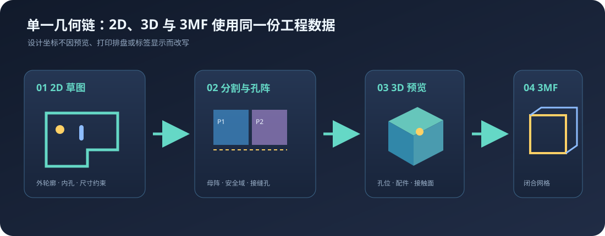

# SnapBoard v2 项目详细文档

更新时间：2026-09-04
文档定位：当前代码实现、数据流、文件接口和部署边界的交接文档。

> 本文描述“现在代码已经做了什么”。实验脚本、旧版模块和未来规划不会被当成当前功能。具体字段校验以 `src/types/geometry.ts`、`src/utils/projectFile.ts` 和 `src/utils/export3mf.ts` 为准。

## 功能插图索引

以下插图用于快速理解项目中最重要、但不容易从单张 UI 截图看清的关系：

-  [2D → 分割 → 3D → 3MF 单一几何链](assets/geometry-single-source.svg)；
-  [安全域、候选分割、融合评分和孔阵裁取](assets/split-algorithm-pipeline.svg)；
-  [插入、贴面、下滑锁止的代理碰撞流程](assets/assembly-collision-flow.svg)；
-  [锚点与目标孔的刚体配准约束](assets/assembly-constraint-system.svg)；
-  [纹理实验室与基层/表层制造](assets/texture-manufacturing-stack.svg)；
-  [制造网格、排盘和切片器交付校验](assets/export3mf-verification.svg)；
-  [主配件与通用附属件的资源包/独立打印关系](assets/part-bundle-workflow.svg)。

这些图是技术解释图，不替代真实页面截图；涉及 UI 交互时必须同时记录浏览器尺寸、操作路径和前后状态。

## 1. 项目定位

SnapBoard 是一个面向 3D 打印洞洞板的浏览器设计工具，核心流程是：

```text
官网/社区
   ↓ /design
2D 草图与尺寸约束
   ↓ 自动分割
可打印板件、原始轮廓长孔母阵、跨板孔与边缘融合
   ↓ 3D 预览
孔位确认、配件拖放、吸附与装配检查
   ↓ 文件
.snapboard 可编辑项目 + 3MF 制造文件
```

当前版本的重点不是把网页当成一个普通 CAD 画板，而是让同一份参数和几何状态同时驱动 2D、3D、分割和制造输出。

## 2. 当前状态概览

| 能力 | 当前状态 | 入口 |
|---|---|---|
| 2D 草图、直线/矩形/圆/弧/槽口/多边形 | 已实现 | `SketchViewport2D.tsx`、`useSketchTool.ts` |
| 预制板型、SVG/PNG/JPG 外形导入 | 已实现 | `features/shapeLibrary/`、`ShapeLibraryDialog.tsx` |
| 智能尺寸、约束求解、撤销/重做 | 已实现 | `@salusoft89/planegcs`、Command |
| 正交板件自动分割与边缘融合 | 已实现 | `pegboardSplit.ts` |
| 2D/3D 孔位同步与候选孔虚线 | 已实现 | `SketchViewport2D.tsx`、`boardMesh.ts` |
| 3D 板件和配件装配预览 | 已实现 | `Viewport3D.tsx` |
| 多场景宿主目录、导轨/型材/墙面几何求解 | 基础架构已实现，连接器标定逐步开放 | `assembly/`、`multiSceneAssembly.ts`、`装配资源包/` |
| 设置与资源中心 | 已实现 | `SettingsDialog.tsx`、`/api/resource-management/summary` |
| 本地 `.snapboard` 项目保存/打开 | 已实现 | `projectFile.ts`、Vite 本地 API；自动写入 `snapboard-attribution/v1` 生成标识 |
| 用户自选本地工作目录 | 已实现 | File System Access API + IndexedDB |
| 多盘 3MF 导出 | 已实现 | `export3mf.ts`；模型元数据和 `Metadata/snapboard-attribution.json` 自动写入生成标识 |
| 板件背面永久装配标识 | 已实现，待实物标定 | `assemblyMarking.ts`、`AssemblyMarkingPanel.tsx`、`Metadata/snapboard-assembly-map.json`；详见 [`BACK_ASSEMBLY_MARKING.md`](BACK_ASSEMBLY_MARKING.md) |
| Bambu Studio 盘号兼容校验 | 已实现 | `validateBambuPlateLayout()` |
| PETG 制造预设与温度 | 已实现 | `bambuPrinterPresets.ts`、`export3mf.ts` |
| SnapColor PETG 黑白/RYBW/CMYW/5色/6色/8色 | 已实现 | `snapColorLut.ts`、`public/snapcolor/luts/` |
| 顶部洞洞板模具分层 | 已实现 | `export3mf.ts` |
| 复合板父对象绑定与上下对称倒角 | 已实现 | `export3mf.ts`、3MF `<components>` |
| 基材/表层独立切片参数 | 已实现 | `export3mf.ts`、`model_settings.config` |
| SnapColor 彩色版画 / PETG 质感贴面 | 已实现 | `TextureStudio.tsx`、`BoardTextureConfig` |
| 纹理工作室板面直接拖动/缩放 | 已实现 | `TextureStudio.tsx`、`Viewport3D.tsx` |
| 纹理避让区与局部留白 | 已实现 | `BoardTextureConfig.avoidZones`、`boardTexture.ts`、`TextureStudio.tsx` |
| 数学密铺（方格/三角/六边形/Truchet） | 已实现 | `texturePatterns.ts`、`TextureStudio.tsx` |
| 多图片图层、阵列与每板分配 | 已实现 | `textureComposition.ts`、`boardTexture.ts` |
| 纹理正视辅助与视角恢复 | 已实现 | `Viewport3D.tsx` |
| 遮挡分析、三区密度与 3D 热力层 | 已实现 | `occlusionModel.ts`、`occlusionPolicy.ts`、`OcclusionPreviewPanel.tsx`、`occlusionOverlay.ts` |
| 异形板边缘优先布局建议 | 已实现 | `layoutAdvisor.ts`、`LayoutAdvisorPanel.tsx`、`layoutSuggestionOverlay.ts` |
| 导出进度、取消和大板分段生成 | 已实现 | `Toolbar.tsx`、`export3mf.ts` |
| 左右栏靠边折叠/悬停展开 | 已实现 | `DesignerApp.tsx`、`App.css` |
| 8 类配件目录与双布局扫描 | 已实现 | `sync-part-library.mjs`、`part-category-rules.mjs` |
| 批量导入、Portal 弹窗与改名 | 已实现 | `PartImportDialog.tsx`、Vite API |
| 长孔轴向、全局占孔与 contactZ | 已实现 | `slotAxisProbe.ts`、`assemblySnap.ts` |
| 工作台布局: 右栏全高列 + 业务工作区 tab 一级入口 | 已实现 | `DesignerApp.tsx`、`RightSidebar.tsx` |
| 2D/3D 滑块开关 + 左/右/顶三侧玻璃滑出收起 | 已实现 | `Toolbar.tsx`、`App.css` |
| 配件库吸顶、资源序号、分类移动与删除 | 已实现 | `PartLibraryPanel.tsx`、`PartImportDialog.tsx`、`/api/part-library/batch` |
| 网页退出开发服务 | 已实现 | `/api/system/shutdown` |
| 云端保存 | 接口已预留，服务端未随本项目提供 | `VITE_PROJECT_STORAGE_API_BASE` |
| STEP/SLDPRT 浏览器直接编辑 | 未实现 | 后续 OpenCascade/WASM 方向 |
| 材料力学/装配耐久校准 | 计划中 | [`MECHANICAL_VALIDATION_PLAN.md`](MECHANICAL_VALIDATION_PLAN.md)；当前只有几何回归，尚无强度保证 |

## 3. 运行环境

### 3.1 安装与启动

```bash
npm install
npm run dev       # 默认 http://localhost:5173
npm run build     # parts:sync + TypeScript + Vite production build
npm run lint      # oxlint
```

Windows 项目目录提供 `SnapBoard Studio.lnk` 和 `一键启动 SnapBoard.bat`。快捷方式会先检查依赖，再启动 `npm run dev -- --host 127.0.0.1`，轮询 `/design` 确认服务就绪后才打开浏览器；若 5173 已有可访问服务，则直接复用。

启动前会执行 `npm run parts:sync` 与 `npm run assembly:sync`，分别把 `配件资源包/`、`装配资源包/` 同步成网页运行时可读取的 `public/partLibrary/`、`public/assemblyLibrary/`。Vite 配置中的 `server.watch.ignored` 用于规避 Windows 原子保存临时目录触发的 EBUSY，不能随意删除。

### 3.2 页面路由

| 路由 | 页面 | 主要入口 |
|---|---|---|
| `/` | 产品首页 | `src/components/site/SiteApp.tsx` |
| `/community` | 社区方案 | `SiteApp.tsx` |
| `/guide` | 使用指南 | `SiteApp.tsx` |
| `/print` | 打印服务说明 | `SiteApp.tsx` |
| `/design` | 设计器 | `src/components/designer/DesignerApp.tsx` |

`src/App.tsx` 负责 History API 路由和设计器懒加载。

## 4. 技术栈与运行时分层

| 层 | 当前实现 | 责任 |
|---|---|---|
| 应用 UI | React 19 + TypeScript 6 | 页面、工具栏、侧栏和状态反馈 |
| 构建 | Vite 8 | 开发服务器、生产构建、开发期本地 API |
| 2D 绘图 | Canvas 2D 自研编辑器 | 点、边、轮廓、尺寸和交互命中 |
| 约束求解 | `@salusoft89/planegcs` WASM + 本地正交求解 | 尺寸约束和草图状态 |
| 3D | Three.js r185 + WebGL | 场景、网格、材质、灯光、射线拾取 |
| 3D 后处理 | `EffectComposer`、`OutlinePass`、`OutputPass` | 选中轮廓和显示质量 |
| 状态 | Zustand 5 | 当前工程、板件、配件、分割结果和 UI 状态 |
| 几何 | `polygon-clipping`、Three.js Shape/ExtrudeGeometry | 二维布尔与三维实体网格 |
| 文件压缩 | `fflate` | 3MF OPC/ZIP 容器 |
| 本地持久化 | Windows 文件系统 API + IndexedDB | 用户授权目录和项目文件句柄 |
| 开发期后端 | `vite.config.ts` 中间件 | 本地项目库和配件导入/标定 |

`@react-three/fiber` 和 `@react-three/drei` 属于依赖，但当前核心 `Viewport3D` 采用直接 Three.js 场景管理；不要把它描述成完全由 React Three Fiber 渲染。

资源包监听只对模型、图片等资产文件做 500 ms 防抖，并通过 `vite.config.ts` 的同步队列串行执行 `sync-part-library.mjs`。同步器自动写入的 `part.json`、`pack.json` 和目录事件不会再次触发回环；导入、标定、改名等 API 也共享同一队列。这样即使一次放入几十个模型，也不会并发写 `public/partLibrary/index.json` 导致 Vite 进程退出和前端出现 `Failed to fetch`。

## 5. 代码结构

```text
src/
├── App.tsx                         # 路由壳与懒加载
├── components/
│   ├── designer/DesignerApp.tsx   # 设计器三栏布局与状态栏
│   ├── toolbar/Toolbar.tsx         # 工具、文件、分割、视图切换
│   ├── sidebar/                    # 属性、分割引擎、配件库
│   ├── viewport/                   # 2D、3D、轮盘交互
│   └── site/                       # 首页和内容页
├── store/useAppStore.ts            # 唯一运行时工作区
├── hooks/useSketchTool.ts          # 2D 绘图状态机
├── commands/                       # 可撤销命令
├── types/geometry.ts               # 几何、工程、分割权威类型
├── utils/
│   ├── pegboardSplit.ts            # 分割和孔位
│   ├── panelBoolean.ts             # 内孔/切口布尔
│   ├── boardMesh.ts                # 预览与制造板件网格
│   ├── export3mf.ts                # 3MF 生成与网格校验
│   ├── snapColorLut.ts             # SnapColor PETG LUT 与叠色配方
│   ├── boardTexture.ts             # 纹理预处理和视觉映射
│   ├── projectFile.ts              # 项目文件、目录授权和本地 API
│   └── assemblySnap.ts             # 配件吸附
└── partLibrary/                    # 配件类型与资源包运行时类型
```

## 6. 运行时数据流

`useAppStore` 保存以下工作区数据：

- `project`：草图、轮廓、特征、材料和像素到毫米比例；
- `boards`：兼容早期演示板工作流的板对象；
- `placedParts`：已放置配件、参数、旋转和吸附结果；
- `splitConfig`：热床、孔位、板厚、倒角、间隙和推荐打孔选项；
- `splitResult`：源轮廓、分割板件、警告、覆盖率和时间戳；
- `undoStack/redoStack`：Command 对象，只存在于当前会话，不写入项目文件；
- `ui`：当前工具、选择、2D/3D 模式、侧栏折叠状态等临时界面状态；
- `boardTexture`：纹理源、图片映射、SnapColor 建模模式、PETG LUT、调色和顶部模具厚度。

命令还带有 `affectsSketch` 范围标记。草图命令默认为 `true`，会刷新约束和已显示的分割结果；配件放置、移动、删除以及旧演示板命令标记为 `false`，只刷新 3D 装配，不启动分割 Worker。

修改草图后会更新求解状态；修改分割参数或外轮廓后，分割结果按当前配置重新生成。加载项目会清空命令历史和临时选择，再计算约束状态。

## 7. 2D 几何与分割

### 7.1 坐标

草图内部使用 Canvas 世界坐标，`Project.config.pixelToMM` 负责像素到毫米换算。进入洞洞板分割时，Y 方向转换为工程坐标中的向上方向。板件、孔位和导出文件统一使用毫米。

### 7.2 轮廓

外轮廓可以是矩形、L 型、阶梯型和其他正交多边形；内轮廓可表示圆、普通多边形、槽口和带弧轮廓。`outer` 是板材实体边界，`inner` 是减材开孔。

规则多边形保留 `center/radius/rotation/polygonCircumscribed` 参数语义。边长、对边间距、顶点距、半径和中心到自身边的内切距会换算为参考半径并整体重建全部顶点，不允许按普通折线局部拉动。圆、正多边形、槽口和普通闭合内孔均提供可点击尺寸中心；中心到外板直边是纯位置尺寸，只整体平移内孔。

擦除由拓扑意图而不是单一 `shape` 判断：正多边形和槽口不论 outer/inner 都按完整参数特征删除；圆若被其它边界交点划分成圆弧段，只删除点中/扫中的圆弧段，未分段孤立整圆才整圆删除；普通 `shape` 未定义轮廓、独立圆弧和混合圆弧继续使用各自修剪流程。预览、点擦和快速擦共用同一策略，撤销一次完整恢复几何与关联尺寸。

### 7.3 圆与圆弧约束求解

圆和独立圆弧不再通过直接修改采样点模拟尺寸变化。`engine/solver.ts` 会把圆编译为虚拟圆心点 + `circle`，把圆弧编译为虚拟弧心点 + `arc` + `arc_rules`，再把 Planegcs 求解后的圆心、半径、起终角和端点写回原 `Contour`。虚拟圆心不会插入 `Contour.points`，因此旧工程的顶点索引、边索引和修剪命令保持兼容。

当前已接入的主动尺寸包括圆半径、圆直径、独立弧半径和弧长。编辑弧半径时，若没有持久化弧长尺寸，本次求解用临时弧长保持原圆心角；编辑弧长时，若没有持久化半径/直径尺寸，本次求解临时保持当前半径。单段圆弧必须满足 `0 < 弧长 < 2πR`，达到整圆时要求改用圆工具，避免求解值与单圈渲染不一致。

曲线边不会参与直线的自动 H/V 约束、正交吸附和纯线段自交判定。圆只要存在主动半径/直径即可完全定义；独立弧需要“半径/直径 + 弧长/弧心角”两类尺寸才完全定义。

混合轮廓采用“识别后开放”而不是全部解禁：当圆弧两端原本都与相邻直线相切时，半径编辑会临时加入两条 Planegcs `tangent_la`，固定两条直线的远端并允许弧心和弧端点移动，因此圆角缩放不会破坏切线。与圆弧只共享一个端点的水平/竖直直线可以修改长度，求解时固定圆弧端点、只移动直线远端。普通装饰弧、连接两段圆弧的直线和任意斜线仍会被拦截，直到持久化相切/同心和跨轮廓约束完成。

`utils/arc.ts` 提供有限直线—圆弧、圆—圆、圆弧—圆弧求交和点到有限圆弧的最近投影。相切只返回一个去重交点；相离、内含和同心重合不会产生虚假交点；圆的切割角度收集可识别其他整圆与混合轮廓弧边。

圆弧与边框相交采用真实拓扑而非视觉重叠：三点弧/圆心弧的起终点落到直边内部时先记录待拆边，圆弧通过几何校验后才执行 `SplitEdgeCommand`；点擦除与单边快速擦除把所有圆/弧交点换算为直线参数区间，因此悬停只高亮交点一侧，点击也只删除该段。继续删掉多余矩形边后，如果剩余开放直线链的两个端点与独立弧吻合，系统会将两者替换为一个包含 `ArcEntity` 的闭合轮廓。该轮廓随后沿自适应曲线离散链进入自动分板和 3MF，而不是停留为两个视觉上接触、拓扑上分离的对象。

圆弧自身也使用同一交点语义：独立弧会按直线/圆/弧交点选择待删参数区间；闭合混合轮廓删除弧边时通过真实拓扑计划打开轮廓，禁止自动补弦。快速擦除把同一手势中的多个直线区间合并计算，并输出全部连通余段。多个开放图元可由 `extractPlanarFaces` 建立半边图，剔除开放尾枝后输出所有简单有界面；默认端点容差为 0.1 世界像素，自交、零面积和超容差缺口均拒绝闭合。

圆弧落边拆点只在圆弧通过共线、半径和跨度校验后提交；取消绘制不会改变工程。所有编辑型命中和交点查询默认限制在 `activeSketchId`，其它草图只有进入显式参考几何模式后才应参与。

### 7.4 自动分割

自动分割入口先调用 `prepareSplitGeometry()`：活动草图中的闭合 outer 直接进入，开放直线/圆弧通过半边图即时提取有界面，不要求用户先擦除或执行自动合并；开放/闭合 inner 统一转为 cutout。选中开放弧或直线时，系统选择它所属的完整面而不是单独一条边。`syncSplitToSketch()` 使用相同入口和真实 `sourceIds`，因此编辑、撤销和重做后不会丢失曲线面。

曲线小数极值会产生非整数 Region 原点。网格边界节点按 1e-6 量化生成拓扑 key，防止 `origin + index + 1` 与 `origin + (index + 1)` 的浮点字符串不同而断链。用户同构“大弧 + 短线 + 小弧 + 竖线 + 底边 + 内六边形”回归由 68.35% 覆盖率修复为 100%，且内六边形保留为一个 cutout。

`pegboardSplit.ts` 负责：

1. 识别外轮廓和内孔；
2. 根据 `mx/my` 模数、最小板宽高和热床有效区域确定切分网格；
3. 在接缝处做边缘孔融合和跨板孔处理；
4. 在原始轮廓上先建立唯一 A/B 长孔母阵，分板只裁取完整落入自身安全域的孔；
5. 计算每块板的 `printRotation`，供热床排盘使用；
6. 生成警告、覆盖率和可制造板件列表。

规则矩形不再采用“每次拿最大矩形”的单向贪心，而是枚举能放入热床的对齐行列网格，并按“无细条、少板、最大最短边、短接缝、低长宽比”选择确定性方案。异形轮廓同时评估均匀模数网格与贴合凹角/转折点的特征网格；最终用 1 mm 横纵连续材料带估计局部结构宽度，默认低于 60 mm 给出制造警告。500×280 mm 基准由旧版包含 20×220 mm 条板的布局，改为稳定的 160/160/180 × 140/140 对齐网格。

功能长圆孔不再只检查包围盒四角。生成器把 5×15 mm 长圆孔视为竖向中心线段与半径 2.5 mm 圆盘的 Minkowski 和，并检查它与外轮廓、缺口和内孔边界的最短距离；`holeBoundaryClearance` 默认再保留 2 mm 实体材料。发生冲突的槽孔/固定圆孔会自动省略，形成留白。数学依据、六边形/手动搭板边界和科创验证路线见 [`SPLIT_ENGINE_RESEARCH.md`](SPLIT_ENGINE_RESEARCH.md)。

孔位流程固定为“原始轮廓长孔母阵 → 分割线/板边 → 两侧连接圆孔”：长孔绝不按 P1/P2…重新起相位。内部接缝圆孔线默认距分割线 10 mm；外周圆孔不再强制固定内缩，而是与内侧最近一排/列长孔共线，沿边坐标取相邻长孔中心的中点，端部只允许半节距外推。随后执行坐标去重、长孔碰撞和 20 mm 最小中心距检查。标准 200×200 外边仍自然得到 DXF 的 10 mm 边距。

分割算法输出的是制造语义，不是简单的矩形裁剪。`SplitPanel.contour` 和 `cutouts` 是实际制造轮廓，消费者不能仅凭 `w/h` 猜测实体形状。

闭合外轮廓若包含 `ArcEntity` 圆弧，进入 Worker 前会按最大 0.05 mm 弦高误差且不超过 7.5° 的角步长离散为毫米多边形，再沿同一分板、孔阵和布尔流程处理；因此圆角外轮廓不会退化成只连接圆弧端点的尖角。多个开放直线/圆弧由半边图提取简单有界面，共享边可生成相邻多个区域。

### 7.5 孔位语义

- 长圆孔：默认 5×15 mm；每块板局部 A 相为 `(10,30)+40n`、B 相为 `(30,10)+40n`；
- 边缘候选圆孔：用户确认制造规格 φ5；标准板/内部接缝使用 10 mm 内缩，非模数外周优先对齐最近长孔行/列；
- `knocked=true`：真实贯通孔；
- `knocked=false`：完整板面上的候选位置，只显示虚线；
- `manual=true`：用户对自动推荐结果的覆盖；
- 结构性边缘缺口：属于板件实际外轮廓，不允许被当成普通候选孔反复切换。

因此“虚线孔”不会生成薄盖、凹槽或浮动物体，也不会进入 3MF。只有用户确认或自动推荐的贯通孔才会切入实体。

## 8. 3D 渲染管线

`Viewport3D.tsx` 在浏览器中创建 Three.js 场景：

```text
Zustand 工作区
   ↓
generateBoardMesh / generateSplitPanelMesh
   ↓
Shape + Path + ExtrudeGeometry
   ↓
MeshStandardMaterial / LineDashedMaterial
   ↓
PerspectiveCamera + lights + GridHelper
   ↓
WebGLRenderer + OrbitControls + Raycaster
```

板件网格使用二维 `Shape/Path` 先表达外轮廓和真实通孔，再沿 Z 轴挤出板厚。实时预览使用较轻的曲线离散；制造导出使用 48 段曲线并加入约 0.35 mm 倒角，同时保持最终 Z 厚度精确等于配置的板厚。

3D 中的配件拖放通过相机射线与板面求交，先显示碳灰半透明模型；模型上的长圆孔锚点固定显示为胶囊、圆孔锚点显示为圆形。整组尚未匹配时只以金色显示最近一个兼容引导孔，匹配后改为绿色精确孔组，再根据孔型、轴向、占用和旋转限制完成吸附。选中对象通过后处理轮廓高亮。P1/P2 等标签、虚线孔和拖拽预览都标记为预览对象，不能污染制造网格。

## 9. 配件资源包与装配

资源包位于：

```text
配件资源包/<包名>/
├── pack.json
└── parts/<零件 ID>/
    ├── part.json
    ├── model.3mf / model.stl / model.glb
    ├── preview.glb
    └── source.step（可选归档）
```

`part.json` 描述名称、说明、类别、资源序号 `sortOrder`、模型格式、单位、朝向、打印模型和装配锚点。锚点类型为 `slot`、`round` 或 `either`，多锚点零件会整体匹配，不通过拉伸零件来凑孔距。`sortOrder` 为数值，越小越靠前；缺失时同步脚本按当前扫描顺序自动补写 10、20、30…，给后续插入预留间隔。

模型导入弹窗会在浏览器本地读取 STL/3MF/GLB/GLTF 的包围盒，并把 `model.dimensionsMm`（X/Y/Z 毫米）写入 manifest；卡片会显示尺寸标签。3MF/GLTF 含多个顶层对象时，弹窗可选择实际渲染的主体，选择结果以 `model.renderNode` 的子路径保存，适合“挂钩 + 托盘”这类分体模型；批量选择多个文件时也可以逐个跳过不参与装配的组件。该字段只控制预览与装配显示，制造模型仍由 `model.print` 决定。

资源目录兼容两种布局：传统 `<包>/parts/<零件>/part.json`，以及大类根 `<大类>/<零件>/part.json`；两种布局都支持再嵌套一层用户细分文件夹，例如 `01-挂钩类/直钩/<零件>/`。`part.json.subcategory` 会作为显式细分名称，缺失时由同步器从目录推断。网页可新建细分文件夹、按细分筛选，并在每个细分标签悬停时显示删除按钮；删除有内容的文件夹会二次确认并连同其中配件一起删除。`GET /api/part-library/group?category=...` 会读取实际目录（包含尚未放入零件的空文件夹），导入和改名弹窗优先显示已有目录，最后才提供“自定义…”输入；新建成功后面板立即更新本地清单。8 个大类目录通过共享的 `scripts/part-category-rules.mjs` 分类；散放模型会拆成每文件一个零件目录。网页批量导入单文件上限 200 MB，单文件失败不会阻断后续文件。
配件列表的无封面模型缩略图使用 `IntersectionObserver` 延迟到视口附近后再创建 WebGL 渲染任务；切换分类或打开面板时不会一次性加载全部模型。

配件库按“安装到 → 选择配件”组织为任务式插入器。宿主场景直接驱动“适配当前/全部”、结果数量和卡片兼容状态；主列表只保留缩略图、名称、尺寸、当前场景状态和拖入3D提示。搜索与范围切换常驻吸顶层，分类、细分、遮挡与排序进入同栏筛选页，筛选时列表退出而不是被浮层覆盖。标题栏以明确的“⚙ 管理”承载资源级操作，每张卡以“⚙ 配件设置”承载查看详情、编辑资料与图片、装配标定，不再使用含义不明的三点按钮。导入保留标题栏按钮和整片列表文件拖入；资源包摘要、批量、资源顺序和细分增删进入“管理配件库/设置与资源中心”。调整资源顺序时才显示 ⠿ 手柄，结果仍通过 `POST /api/part-library/batch` 的 `reorder` 动作写回；批量模式仍支持全选、清空、移动和删除。

设计器支持 `zh-CN` 与 `en-US` 两种界面语言。`I18nProvider` 管理运行时语言和 `snapboard-ui-language` 本地持久化；顶部“中 / EN”按钮即时切换，无需刷新。现有固定中文界面通过严格的内置文案词典和 `MutationObserver` 兼容层更新，监听范围为 `document.body`，因此挂载到 Portal 的预览、标定与设置弹窗也会同步；新组件可通过 `useI18n().t()` 显式读取翻译。词典覆盖工具栏、左侧特征/属性/约束工作区、四个右栏工作区和各类弹窗。只有软件内置文本进入词典，用户导入的零件名、项目名、资源包名、目录名和自定义说明保持原文；需要强制排除的节点标记 `data-i18n-ignore="true"`。英文长文案通过 `html[lang="en-US"]` 作用域样式单独适配：提高到 12–14px 主阅读字号、增加控件高度并允许合理换行，空间不足时使用工具栏横向滚动，不改变中文版密度。

分割/配件/纹理是右栏顶部同级的双层业务入口，标题下方显示当前状态或用途说明。第二工具栏提供紧凑的自动/取消分割按钮与独立 2D/3D 开关：选择分割进入 2D，选择配件或纹理进入 3D；之后仍可手动切换视图而不关闭当前右栏内容。

自定义图片在 3D 板面上采用“轻量交互、结束提交”：拖动或滚轮期间只移动/缩放图片范围虚线框，结束后一次性更新纹理参数和画布纹理，避免 `CanvasTexture` 边缘重复造成条纹拖影，也避免状态提交后先回旧位置再跳回新位置。虚线框表示原图在整板坐标中的完整覆盖范围，超出板面的内容也能被识别。

长圆孔锚点保存局部安装面内单位向量 `axis`；当前参考板和正式板的长孔均为竖直 `[0,1]`。标定器不再依赖端面网格猜测横/纵方向，而以受限代理碰撞验证：锚点端面记录 `profile` 尺寸，多个安装柱先检查是否处于同一插入平面；零件沿法向插入到 `contactZ` 碰到板面代理层，再按 `(15 - 安装柱长度) / 2` 向下滑移，多个长孔取最先碰底的距离。旧锚点无尺寸时按 5 mm 安装柱得到 5 mm 行程；纯圆孔紧固件的 `slideY` 为 0，贴面即完成。默认 UI 只展示定位、自动检测和保存，朝向/坐标/手动覆盖折叠到高级设置。所有已放置零件的 `targetIds` 汇总成正背面共享的占用集合；自动装配命中未开候选圆孔时执行幂等开孔。

标定触发采用显式状态机：逐个添加长孔/圆孔只更新锚点，绝不播放动画；用户点击“孔位选择完成”后才执行一次接触面识别与装配。首个孔端面会自动把法向转到板面方向，长孔 PCA 主轴自动转为竖直；接触面沿安装柱内法向做双面三角射线识别。识别失败或多个柱结果不一致时自动切换到手动接触面，手动值优先保存。由于长轴正负等价会留下 180° 手性歧义，界面保留“上下翻转并重装”和高级 XYZ 微调。

标定器的默认朝向旋转绕模型变换后包围盒的固定几何枢轴进行，避免 STL/3MF 原点偏离实体中心时零件被甩出视野。拖动 X/Y/Z 旋转环期间会暂停 OrbitControls，并逐帧恢复相机位置、观察目标和缩放；改角度只改变零件姿态，不改变相机。

三轴标签不放在三个轴的交点，而放在对应旋转圆环的弧中点：X 对应 YZ 面，Y 对应 XZ 面，Z 对应 XY 面，减少标签、刻度和零件之间的视觉重叠。

`mount.contactZ` 表示零件局部贴板接触面的 Z。正面装配使用 `target.z - contactZ`，背面先翻转 `contactZ`；未设置时才回退到锚点平面。

同一套标定锚点可用于板件正反两面。锁定“正面/背面”视角时严格使用所选装配面；自由视角下根据相机相对板厚中面的位置实时判断当前面。背面装配会统一翻转锚点 X/Z、法向、长轴 X 分量和 `contactZ`，拖拽提示会显示当前为“正面”或“背面”。

主配件、通用附属连接件、多部件 3MF/STEP 预处理，以及“对孔→插入→贴面→沿长孔滑移→卡止”的后续运动学方案见 [`ASSEMBLY_BUNDLE_DESIGN.md`](ASSEMBLY_BUNDLE_DESIGN.md)。

标定器的接触面是独立定位项，不计入孔锚点。旧版曾把接触面误追加成最后一个圆孔；当前加载时只在“前序锚点共面、末项圆孔明显离面”的严格条件下自动恢复，并要求用户检查后保存。配件卡只有缩略图/正文属于拖拽区域，改名与标定按钮不会再触发浏览器卡片拖影。

开发期将资源包同步到 `public/partLibrary/`；零件库可导入用户的 3MF、STL、GLB 或 GLTF。导入时可选上传 `usage.png/jpg/webp` 实装示例图，网页也会自动识别零件目录中的 `usage`、`assembly`、`install`、`photo` 图片。配件卡片的缩略图只负责识别，点击后打开移动端友好的大预览：用户可旋转/缩放模型、使用装配/正面/顶部/侧面快捷视角，并将当前相机方向保存为 `model.previewDirection`。大预览同时读取已保存锚点、`contactZ` 与 `slideY`，并与标定器共用参考板定位、真实孔位目标生成和 `fitPartAnchors` 刚体配准；模型应用求解得到的平移与 `rotationZ` 后再播放“对准孔位 → 插入贴面 → 下滑或零偏移锁止”，不能用视觉偏移代替孔位求解。动画支持返回模型和连续重播；缺少锚点、接触面或无法匹配真实孔距的零件会在原位置提供重新标定入口。资料编辑负责名称、说明、分类和已有配件实装图的添加/替换，替换会生成新的带版本文件名以避免浏览器缓存；已有照片可通过“删除照片”调用删除接口移除。装配标定负责默认朝向、接触面和装配锚点。3MF/GLB/GLTF 的原生材质保留，主 3D 渲染器统一使用 sRGB 输出与 ACES 色调映射；STL 本身不携带颜色信息。缺少制造模型的零件可以在网页中预览，但 3MF 导出时会被跳过并给出警告。

装配宿主使用独立的 `装配资源包/`，不再与可打印配件模型混放。每个包包含 `pack.json` 和若干 `hosts/<id>/host.json`，经 `npm run assembly:sync` 生成 `public/assemblyLibrary/index.json`；前端通过 `useAssemblyLibrary` 读取并与内置兜底目录合并。当前索引包含洞洞板、4 类安装导轨、10 类铝型材槽和 4 类墙面工艺，共 19 个宿主。item、Bosch Rexroth、MISUMI 以及不同槽系列使用独立兼容键；未知截面尺寸保持未知，不能退化成按槽宽猜测。设置中心可导入自包含 `snapboard-assembly-host-bundle`，但只写入固定的 `90-用户导入`，并拒绝覆盖重复 ID/兼容键。

顶部“设置”打开本地资源中心，展示配件/宿主包统计、标定情况、项目与制造文件、受控目录大小和索引问题。只读概览 API 只扫描项目内五个白名单目录，不接受外部路径，也不提供删除/移动；文件写入仍由专用配件导入、宿主 bundle 导入、资源同步和项目保存接口完成。

实装照片接口为 `POST /api/part-library/usage-image?packageId=...&localId=...&filename=...` 和 `DELETE /api/part-library/usage-image?packageId=...&localId=...`；上传会替换旧实装图，删除只移除照片，不删除模型和配件资料。

## 10. 项目文件与保存位置

### 10.1 `.snapboard`

`.snapboard` 是 UTF-8 JSON，格式为 `snapboard-project`，当前 schema 为 1。它保存可继续编辑的工作区，不保存命令历史、相机、选择和临时渲染缓存。打开前会校验格式、版本、草图、板件、配件和分割结果。

### 10.2 三种本地保存路径

1. 开发环境默认项目库：`snapboard-v2/已保存项目/`；
2. 用户通过“保存位置”授权的本地目录：项目写入目录根，3MF 写入 `制造导出/`；
3. “另存为”系统文件选择器：只针对当前项目文件单独选择路径。

用户选中的目录句柄保存在 IndexedDB，页面刷新后会尝试恢复；浏览器可能要求重新授权。浏览器安全策略不允许网页读取用户磁盘的绝对路径，因此界面显示目录名和文件名，而不是伪造完整绝对路径。

### 10.3 本地开发 API

`vite.config.ts` 提供受限的项目库中间件：

| 方法 | 路径 | 作用 |
|---|---|---|
| POST | `/api/project-library/save?filename=...` | 写入 `.snapboard` |
| GET | `/api/project-library/list` | 列出项目库文件 |
| GET | `/api/project-library/open?filename=...` | 读取项目 |
| POST | `/api/project-library/export?filename=...` | 写入 `制造导出/` 下的 3MF |

服务端限制文件名字符、路径越界和请求体大小；这不是生产云服务，只是本地开发/测试适配层。

### 10.4 云端预留

设置：

```text
VITE_PROJECT_STORAGE_API_BASE=https://your-api.example.com/api/project-library
```

前端会把同样的 `save/list/open/export` 请求发到该基址。生产后端应补充身份认证、项目所有权、版本冲突、对象存储和数据库索引；浏览器目录授权只属于本地模式，不应被当成云端文件系统。

## 11. 3MF 制造导出

3MF 由 `fflate` 在浏览器端直接生成，核心文件包括：

- `[Content_Types].xml`；
- `_rels/.rels`；
- `3D/3dmodel.model`；
- `Metadata/model_settings.config`，用于 Bambu/Orca 多盘与实例映射。

导出流程：

1. 确认当前分割结果；
2. 生成板件制造网格；
3. 加载已放置配件的 `model.print`；
4. 相同制造几何复用一个 3MF object；
5. 按热床有效区域、间距、禁放区和旋转建议排盘；
6. 合并顶点、检查每条无向边恰好被两个三角形使用；
7. 校验盘号和对象实例映射；
8. 保存项目快照和 3MF。

制造输出不包含：2D 尺寸、P1/P2 标签、3D 虚线、相机、灯光、材质预览和拖拽辅助对象。

Bambu 的 `plater_id` 必须写为从 1 开始的连续盘号；对象/实例 ID 必须有效且唯一。旧版错误盘号生成的文件不能通过代码自动追溯修复，必须重新导出。

盘名（`plater_name`）不按盘序编号，而是与板件自身的 P 编号同源：

- 板件盘：`SnapBoard 板件 P01`；一盘装多块板时为 `SnapBoard 板件 P01、P02`。P 编号从盘内实例对象名提取，与背面刻字、逐板文件名共用 `stablePanelIds()` 同一个来源，因此切片软件里的盘名、板子背面的刻字、分板压缩包里的文件名三者必然一致。
- 配件盘：`SnapBoard 配件`；只有配件占多盘时才补序号（`SnapBoard 配件 2`）。
- 试样盘：`SnapBoard 试样（先打印）`，同样不带盘序。

旧版按盘序编「第 N 盘」的文件，盘序与 P 编号在一盘装不下整单板件时必然错位（盘 1 可能装 P01 和 P02 各一部分，盘 2 才是 P03），不能通过代码追溯修复，必须重新导出。该行为由 `verify:native-process` 的盘名回归断言锁定：板件盘名必须匹配 `SnapBoard 板件 P\d+`、配件盘必须以「SnapBoard 配件」开头、任何盘名不得再出现「第 N 盘」。

## 12. PETG、SnapColor 与纹理工作室

SnapColor品牌边界、旧工程兼容、当前封闭入口以及后续重新开放检查表见 [`SNAPCOLOR_PACKAGING.md`](SNAPCOLOR_PACKAGING.md)。

当前制造默认使用 PETG，不再使用 PLA 模板：Bambu 工程写入 PETG HF 耗材配置，喷嘴温度 245°C，首层 230°C，热床 70°C。纹理工作室提供 PETG 校准 LUT：黑白、RYBW、CMYW、5 色扩展、6 色 Smart 1296 和 8 色 Max，并提供单材质质感贴面方案。

彩色版画板件的实体结构为：

```text
0 .. 4.0 mm       结构基层（内部拼接面平直，负责一侧外表面倒角）
4.0 .. optical    顶部洞洞板承托模具
optical .. 5.0   SnapColor PETG 光学叠色层（5×0.08 或 6×0.08 mm）
```

上表是设计坐标中的逻辑层序。选择“细磨砂面”时，导出器会将整个复合板沿 Z 轴翻转，使装饰面落在 z=0、贴合纹理 PEI 热床；选择“普通顶面”则保持装饰面朝上。

顶部模具与原板共用轮廓 Shape，因此外圆角、槽孔、圆孔和内轮廓不会被彩色层覆盖。基材/表层之间保持平直拼接面，只在复合板最外侧生成倒角：基材负责一侧，表层负责另一侧，最终外缘和孔口上下对称。Bambu Studio 会按实际基础耗材显示白、红、黄、蓝等实体层，不模拟正面透光混色；网页 3D 预览负责显示最终观感。

制造倒角按板件自适应。`ExtrudeGeometry` 对极尖凹/凸角使用统一 `bevelSize` 时可能自交并形成开放边；导出器不会绕过 `validateClosedMesh`，而是对该板依次尝试配置倒角、1/2、1/4和0，采用第一个每条无向边恰好被两个三角形共享的网格。降级只影响失败板件，并写入导出 warnings；普通板继续使用配置倒角。普通结构板、SnapColor结构基材和贴面层共用该策略。

质感贴面使用“普通 PETG 结构基材 + 0.4–2.0 mm 单耗材表层”。默认示例为普通白色 PETG 加浅绿色 PETG 大理石；材料名称、颜色、贴面厚度和基材填充率均写入工程。细磨砂不是通过 fuzzy skin 扰动孔壁，而是把装饰面翻到 z=0，贴合纹理 PEI 热床成型；也可切换为普通朝上顶面。

3MF 全局工艺以结构基材为准：0.28 mm 层高、2 道壁、0.6 mm 顶/底壳和默认 15% gyroid（可调 5–50%）。0.6 mm 承托层使用 0.28 mm；只有 SnapColor 光学层在 `model_settings.config` 中单独覆盖为 0.08 mm、100% 填充和慢速。SnapColor 装饰面朝下时首层也强制 0.08 mm，避免全局首层覆盖叠色；单材质贴面或普通基材首层约 0.25 mm，后续 0.28 mm。父对象通过 3MF `<components>` 引用全部层，移动父对象会带动所有层，不同材料仍可独立选择耗材槽。

纹理工作室分为：贴图纹理（内置图案经 SnapColor 叠色）、材质纹理（4 mm 普通基材 + 约 1 mm 高级 PETG）和自定义图片。当前发布只开放PNG/JPG/WebP高保真图片；像素艺术与SVG矢量入口由功能门关闭。图片在 3D 板面直接拖动可更新全局偏移，滚轮按图片中心连续缩放；提交新比例前保留临时纹理矩阵，避免“缩放→复位→再次缩放”的闪跳。

纹理源现扩展为贴图、数学密铺、材质和多图片。数学密铺以毫米坐标生成方格、正三角、正六边形和Truchet图元，种子/单元/线宽/颜色随工程保存；多图片把资源与图层分开，每图可自由、阵列、错列或每板重复，也可按板件顺序自动分配。进入纹理工作室时3D相机会临时正视并锁定旋转，当前自由图层可直接拖动和滚轮缩放；退出后恢复原相机。实现与研究边界见[`TEXTURE_COMPOSITION_AND_TILING.md`](TEXTURE_COMPOSITION_AND_TILING.md)。

每板图片序列支持`panelAssetMap`显式映射，用户可分别指定P1/P2/P3图片；资源托盘不随图层删除，退出每板模式会恢复自由图层，因此切换排列方式不会丢失已经导入的图片。

彩色光学层默认启用基材单线封边：距离场同时计算到外轮廓和所有孔壁的距离，名义0.50mm范围内的光学单元改由1号结构基材耗材生成，并从白/红/黄/蓝等彩色对象中剔除。封边按每个SnapColor层独立生成，贯穿完整光学栈且服从该层的制造倒角；这比只在最外面覆盖一个0.08mm层更可靠，因为下面的彩色层不会继续暴露在侧边。`edgeSealEnabled` 可关闭，`edgeSealWidth` 可在纹理工作室中以0.05mm步长调整；当前高保真模式默认接近一道0.4mm喷嘴外墙。

## 13. UI 操作入口

工具栏“重画”执行工作区事务：清空当前草图及依附旧板的分割结果、旧版板对象、已放置配件、纹理、装配实例/关系和遮挡分析派生状态；项目/打印参数、资源库和宿主定义保留。该动作作为一条 Command 入栈，单次撤销可恢复完整设计，草图已空但仍有悬空派生状态时按钮仍可使用。

工具栏“板型库”是草图轮廓的统一来源层。8 个内置模板由 `presets/` 纯几何生成；SVG 与位图分别由 `import/svg.ts` 和 `import/bitmap.ts` 在浏览器本地解析，再经 `validation.ts` 检查闭合、自交、孔包含、碎片、窄结构与顶点上限。所有来源最终适配为同一个 `ShapeDraft`，由 `applyShape.ts` 作为单条 Command 写入草图。替换外轮廓会复用重画清理事务；作为内孔插入会先检查整个剪影位于现有闭合外轮廓内。`Contour.source` 只保存模板 ID、文件名和参数，不保存原始文件正文。

板型库参数单位固定为毫米，写入时除以当前工程 `pixelToMM` 转为草图世界单位；预览读数、智能尺寸和实际制造尺寸因此保持一致。多个分离连通组件会分别写成 outer 并清空单轮廓选择，自动分割处理整组字形；每个字形内部的孔继续写成 inner。应用完成后视口自动适配全部轮廓边界。

板型方向支持水平/垂直翻转和 −180°到180°旋转。旋转围绕整组轮廓包围盒中心进行，多个 outer 与 inner 使用同一个刚体变换；90°旋转会交换占用宽高，任意角度会显示旋转后的轴对齐占用尺寸。角度写入 `Contour.source.params.rotation`，不是仅作用于弹窗截图的 CSS 状态。

草图选择工具支持单选与框选组：点击轮廓边建立主选择；在空白处按住约240ms或直接拖动超过4屏幕像素进入紫色框选，只有完整落入矩形的轮廓被选中。选择组显示四角等比缩放手柄、顶部旋转手柄和框内移动区域。组移动、统一缩放和绕公共包围盒中心旋转均由多个 `UpdateContourPointsCommand` 组成一条 `CompositeCommand`，一次撤销恢复整个选择组；points、center、radius、ArcEntity、slot尺寸和来源参数同步变换。

为避免直接操作破坏求解关系，包围框变换只对无驱动约束、非构造、非无限轮廓开放。受约束轮廓仍通过原有顶点、边和智能尺寸工作流编辑。多选集合保存在会话级 `UIState.selectedContourIds`，`selectedContourId`继续作为属性面板的主轮廓并向后兼容。

SVG 使用严格白名单，不执行脚本、不挂载用户标记、不解析外链；PNG/JPG 提取达到噪点阈值的四连通前景，各组件作为独立板件保留，过小噪点和超量组件才过滤并明确警告。位图提取是轮廓近似，不等于纹理导入；需要彩色图案时仍应使用纹理工作室。

手绘照片和市面图案照片当前属于“二维剪影提取”：高反差、闭合轮廓可以直接形成板型，但斜拍透视、纸张边界、阴影和比例尺仍需用户通过阈值/反相/尺寸校准处理。当前不会自动判断用户想要纸张外框还是纸内某个封闭区域；后续应增加目标区域点选、A4/标尺透视校准和断线修复。

粗线手绘提供三种解释：智能模式只在单一主体且内外边界高度相似时自动填实；实心剪影严格保留二值前景，适合实体Logo；闭合线稿把马克笔粗线围住的区域作为实心板。位图轮廓使用Taubin λ/μ非收缩平滑、面积校正和分辨率自适应RDP，不再先用Chaikin倍增顶点并收缩轮廓。详细依据和样本见 [`BITMAP_OUTLINE_RESEARCH.md`](../../docs-internal/architecture/BITMAP_OUTLINE_RESEARCH.md)。

顶部第一行是绘图工具和二级模式；第二行按以下顺序组织：文件、操作历史、轮廓类型、2D/3D 滑块开关。分割、配件、纹理是业务工作区，一级入口在**右栏顶部的 tab 条**（不再占用第二行）；进入任一工作区会同步切换 2D/3D 并保持右栏工作区。

右侧分割引擎默认以结果为主，参数配置折叠；推荐打孔只会把推荐位置变成贯通孔，其余位置保留虚线提示。底部状态栏显示当前工程、存储来源、已保存数量和最近项目。

工作台布局：右栏为**全高整列**（`designer-app-frame` 内「主列 + 右栏」并行），顶部工具栏/品牌栏在右栏左侧被截断，右栏从窗口顶部一直到底部。左右栏分别有所属面板的收起按钮；拖动分隔条低于阈值会压缩为边缘标签。左/右/顶三侧收起态统一为「透明玻璃细带 + 悬停玻璃滑出」：鼠标靠近边缘即滑出玻璃面板（左/右栏为竖条 rail，整条可点击展开；顶栏为横向条带，点击任意位置展开，面板内含「展开工具 / 状态 / 保存 / 3MF」，支持键盘 Enter/空格）。选择分割、配件或纹理工作区会自动展开右栏并收起左栏。2D/3D 滑块只改变中央视图，不关闭当前右侧工作区。分割结果区标题/板数/摘要/警告常驻，板件列表滚动；配件插入器只让搜索、适配范围和筛选入口吸顶，分类筛选和库管理使用同栏任务页替换列表。1024px 以下右栏以覆盖式抽屉出现；首启清单、一次性上下文提示和 DOM 操作提示可以关闭。

启用自定义图片纹理后，3D 板面左上角会显示“图片定位”浮层：拖动板面改变图片位置，滚轮缩放，右栏可精确修改比例、旋转和偏移。

常用快捷键：

| 快捷键 | 功能 |
|---|---|
| `V` | 选择 |
| `P` | 直线 |
| `R` | 矩形 |
| `C` | 圆 |
| `A` | 弧 |
| `G` | 多边形 |
| `S` | 槽口 |
| `O` | 等距实体 |
| `E` | 擦除 |
| `D` | 智能尺寸 |
| `Ctrl/Cmd + S` | 保存 |
| `Ctrl/Cmd + O` | 打开 |
| `Ctrl/Cmd + Z/Y` | 撤销/重做 |

## 14. 验证与故障排查

每次代码改动至少执行：

```bash
npm run build
npm run lint
```

几何或导出改动还应执行 `.tmp-3d-test/` 中的对应脚本，尤其是：

- `verify-manufacturing-export.mjs`：多盘、斜放、禁放区、实例复用和 Bambu 盘号；
- `verify-interactive-holes.mjs`：候选孔与贯通孔语义；
- `verify-hybrid-cutouts.mjs`：内孔与板件布尔；
- `npm run verify:split`：1000×800、1400×1000 与斜边性能/覆盖率；
- `npm run verify:split-shapes`：矩形、L/U、梯形、缺口、内孔、确定性和孔边留白；
- 其中曲线扇形用例验证“直线链 + 圆弧闭合”离散后生成多块板、保留曲线裁剪边界且覆盖率接近 100%；
- `npm run verify:curves`：圆半径/直径、圆弧半径/弧长、切线圆角变半径，以及直线—弧/圆—圆/弧—弧求交和弧投影；
- 同一命令还覆盖半边图面提取、独立/混合弧修剪、快速多区间余段和撤销快照；
- `npm run verify:edge-holes`：四版拼接 DXF 的 4×(50 长孔 + 18 圆孔)、水平/垂直接缝错列、非模数板四边固定内缩；
- `verify-project-file.cjs`：项目文件解析、非法 schema 和恢复。
- `verify:snapcolor`：品牌边界、LUT资产、旧字段迁移和临时功能门；
- `verify:texture`：图片、LUT、顶部模具和光学层闭合网格；
- `verify-texture-edge-seal.mjs`：彩色光学层外轮廓/孔壁基材单线封边、关闭路径与1号耗材/Z层范围；
- `verify-texture-direct-manipulation.mjs`：板面拖图与滚轮缩放；
- `npm run verify:ui-layout`：玻璃 token、配件紧凑吸顶、响应式覆盖栏、首启清单和 DOM 提示。
- `npm run verify:shape-library`：8 种预制轮廓、恶意 SVG 拒绝、贝塞尔/位图提取、自交与顶点上限、替换/内孔事务及撤销。
- `npm run verify:heart-3mf`：420mm心形多板分割、尖角倒角从0.35mm降至0.09mm、闭合网格和3MF生成；该脚本已包含在 `verify:3mf`。
- `scripts/verify-textured-3mf.mjs <file.3mf>`：全局基材参数、表层 part 覆盖、父对象 components、细磨砂 Z 翻转和 SnapColor/质感贴面两种层级；
- `npm run verify:parts`：8 类词表、双布局扫描、Portal、退出接口和旧锚点状态；
- `npm run verify:assembly`：长孔轴向、90° 拒绝、全局占孔、contactZ、旧锚点探测和候选孔开孔；
- `verify-hole-open-store.mjs`：自动开孔幂等性、无 sources 旧结果兼容和手动切换。

常见问题：

- 打开列表为空：只导出 3MF 不等于保存可编辑项目；重新点击保存或重新排盘，当前实现会同步保存 `.snapboard` 快照；
- 自选目录显示“需要重新授权”：重新点击“保存位置”，这是浏览器目录权限生命周期，不代表文件丢失；
- Bambu Studio 打不开旧 3MF：旧文件可能使用修复前的 0-based `plater_id`，重新导出；
- 旧 3MF 仍显示整块 0.08 mm/100% 填充：旧文件不会被网页修改，重新导出后才会写入基材全局参数和表层 part 覆盖；
- 切片器中只想整体移动复合板：请选择尺寸为“复合板件（整体移动）”的父对象，不要只点子零件；子零件仍可单独修改耗材槽和对象参数；
- 配件不进入 3MF：检查 `part.json` 是否提供 `model.print` 和合法制造网格；
- 构建时报大 chunk：当前是 Three.js/几何依赖的体积提示，不是构建失败。

## 15. 后续工作边界

分割算法、3D 引擎、装配、纹理和 3MF 的阶段性演进与创新证据边界，集中记录在 [`TECHNICAL_EVOLUTION.md`](TECHNICAL_EVOLUTION.md)。本文件负责当前实现和接口细节，演进文档负责“为什么改、改后解决什么、如何证明”。

短期优先级：云端项目 API、项目版本冲突提示、项目缩略图、导出前模型预览和更明确的错误日志。中期再考虑 STEP/SLDPRT 的浏览器几何转换、资源包签名、收藏搜索和大模型分块加载。

不应在没有明确产品决策前加入：静默写入任意电脑路径、把预览虚线导出成实体、用薄盖模拟打孔、让 3MF 文件承载不可验证的切片器配置，或用普通 JSON 绕过 `.snapboard` schema 校验。

## 16. 后续 AI 协作技能

当前 Codex 环境已安装以下辅助技能，后续涉及工程图、3D 视口或导出回归时优先使用：

| 技能 | 用途 | 适用场景 |
|---|---|---|
| `pdf` | PDF 页面渲染、文字提取和版面核对 | 工程图、规格书、打印说明书 |
| `playwright` | 真实浏览器导航、交互、快照和流程调试 | 2D/3D UI 回归、文件按钮流程、设计器冒烟测试 |
| `screenshot` | Windows 桌面、窗口和区域截图 | 对照用户截图检查工具栏、侧栏和 3D 视口 |

当前技能目录没有专门的 CAD/STEP 内核技能。几何理解仍以 `src/types/geometry.ts`、`pegboardSplit.ts`、`boardMesh.ts`、`export3mf.ts`、`assets/drawings/` 和验证脚本为权威来源；后续若引入 STEP 浏览器转换，应单独评估 OpenCascade/WASM，不能把 PDF 或截图技能当成几何内核。
